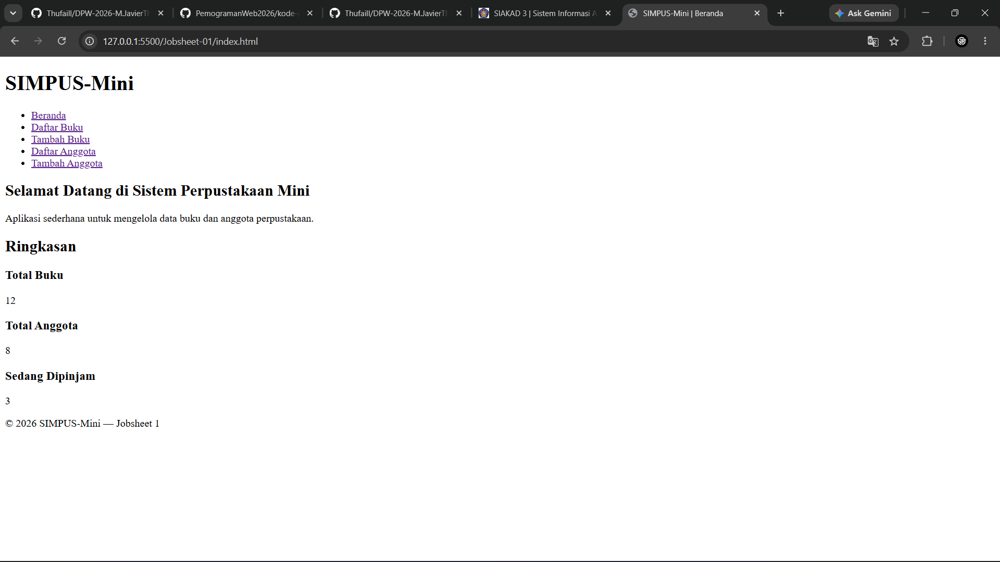
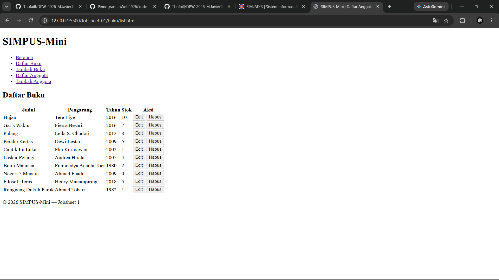
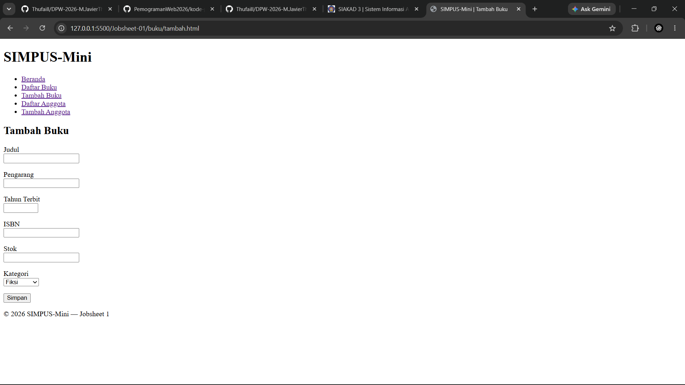
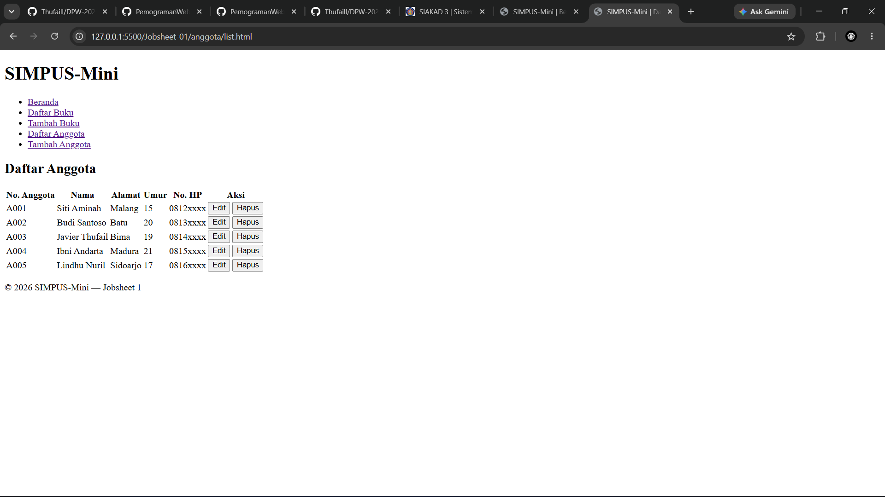
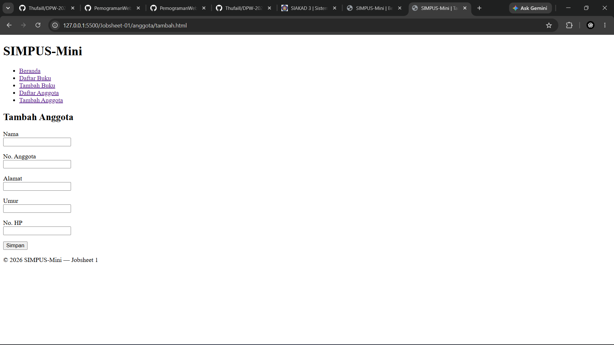

| | |
| :--- | :--- |
| **Mata Kuliah** | : Desain dan Pemrograman Web |
| **Program Studi** | : D4 – Teknik Informatika |
| **Semester** | : 3 |

---

| | |
| :--- | :--- |
| **Kelas** | : TI-2D |
| **NIM** | : 254107020019 |
| **Nama** | : M. Javier Thufail |
| **Jobsheet Ke-** | : 1 |

# LAPORAN JOBSHEET
## 1. index.html (Beranda)
```bash
<!DOCTYPE html>
<html lang="id">
<head>
    <meta charset="UTF-8">
    <title>SIMPUS-Mini | Beranda</title>
</head>
<body>
    <header>
        <h1>SIMPUS-Mini</h1>
        <nav>
            <ul>
                <li><a href="index.html">Beranda</a></li>
                <li><a href="buku/list.html">Daftar Buku</a></li>
                <li><a href="buku/tambah.html">Tambah Buku</a></li>
                <li><a href="anggota/list.html">Daftar Anggota</a></li>
                <li><a href="Anggota/tambah.html">Tambah Anggota</a></li>
            </ul>
        </nav>
    </header>

    <main>
        <section>
            <h2>Selamat Datang di Sistem Perpustakaan Mini</h2>
            <p>Aplikasi sederhana untuk mengelola data buku dan anggota perpustakaan.</p>
        </section>

        <section>
            <h2>Ringkasan</h2>
            <article>
                <h3>Total Buku</h3>
                <p>12</p>
            </article>
            <article>
                <h3>Total Anggota</h3>
                <p>8</p>
            </article>
            <article>
                <h3>Sedang Dipinjam</h3>
                <p>3</p>
            </article>
        </section>
    </main>

    <footer>
        <p>&copy; 2026 SIMPUS-Mini &mdash; Jobsheet 1</p>
    </footer>
</body>
</html>
```
### Penjelasan Kode `index.html` (Beranda)

* **`<nav>` (Navigasi):** Membuat menu tautan (`<a>`) untuk berpindah antar halaman/direktori.
* **`<section>` (Area Konten):** Mengelompokkan bagian "Selamat Datang" dan "Ringkasan Data".
* **`<article>` (Kartu Informasi):** Menampilkan statistik angka (Total Buku, Total Anggota, Dipinjam) secara terpisah.

### Outputnya  


## 2. Buku/list.html (Daftar Buku)
```bash
<!DOCTYPE html>
<html lang="en">
<head>
    <meta charset="UTF-8">
    <title>SIMPUS-Mini | Daftar Anggota</title>
    <link rel="stylesheet" href="../assets/css/style.css">
</head>

<body>
    <header>
        <h1>SIMPUS-Mini</h1>
        <nav>
            <ul>
                <li><a href="../index.html">Beranda</a></li>
                <li><a href="list.html">Daftar Buku</a></li>
                <li><a href="tambah.html">Tambah Buku</a></li>
                <li><a href="../anggota/list.html">Daftar Anggota</a></li>
                <li><a href="../anggota/tambah.html">Tambah Anggota</a></li>
            </ul>
        </nav>
    </header>
    <main>
        <main>
        <section>
            <h2>Daftar Buku</h2>
            <table>
                <thead>
                    <tr>
                        <th>Judul</th>
                        <th>Pengarang</th>
                        <th>Tahun</th>
                        <th>Stok</th>
                        <th>Aksi</th>
                    </tr>
                </thead>
                <tbody>
                    <tr>
                        <td>Hujan</td>
                        <td>Tere Liye</td>
                        <td>2016</td>
                        <td>10</td>
                        <td>
                            <button type="button">Edit</button>
                            <button type="button">Hapus</button>
                        </td>
                    </tr>
                    <tr>
                        <td>Garis Waktu</td>
                        <td>Fiersa Besari</td>
                        <td>2016</td>
                        <td>7</td>
                        <td>
                            <button type="button">Edit</button>
                            <button type="button">Hapus</button>
                        </td>
                    </tr>
                    <tr>
                        <td>Pulang</td>
                        <td>Leila S. Chudori</td>
                        <td>2012</td>
                        <td>8</td>
                        <td>
                            <button type="button">Edit</button>
                            <button type="button">Hapus</button>
                        </td>
                    </tr>
                    <tr>
                        <td>Perahu Kertas</td>
                        <td>Dewi Lestari</td>
                        <td>2009</td>
                        <td>5</td>
                        <td>
                            <button type="button">Edit</button>
                            <button type="button">Hapus</button>
                        </td>
                    </tr>
                    <tr>
                        <td>Cantik Itu Luka</td>
                        <td>Eka Kurniawan</td>
                        <td>2002</td>
                        <td>1</td>
                        <td>
                            <button type="button">Edit</button>
                            <button type="button">Hapus</button>
                        </td>
                    </tr>
                    <tr>
                        <td>Laskar Pelangi</td>
                        <td>Andrea Hirata</td>
                        <td>2005</td>
                        <td>4</td>
                        <td>
                            <button type="button">Edit</button>
                            <button type="button">Hapus</button>
                        </td>
                    </tr>
                    <tr>
                        <td>Bumi Manusia</td>
                        <td>Pramoedya Ananta Toer</td>
                        <td>1980</td>
                        <td>2</td>
                        <td>
                            <button type="button">Edit</button>
                            <button type="button">Hapus</button>
                        </td>
                    </tr>
                    <tr>
                        <td>Negeri 5 Menara</td>
                        <td>Ahmad Fuadi</td>
                        <td>2009</td>
                        <td>0</td>
                        <td>
                            <button type="button">Edit</button>
                            <button type="button">Hapus</button>
                        </td>
                    </tr>
                    <tr>
                        <td>Filosofi Teras</td>
                        <td>Henry Manampiring</td>
                        <td>2018</td>
                        <td>5</td>
                        <td>
                            <button type="button">Edit</button>
                            <button type="button">Hapus</button>
                        </td>
                    </tr>
                    <tr>
                        <td>Ronggeng Dukuh Paruk</td>
                        <td>Ahmad Tohari</td>
                        <td>1982</td>
                        <td>1</td>
                        <td>
                            <button type="button">Edit</button>
                            <button type="button">Hapus</button>
                        </td>
                    </tr>
                </tbody>
            </table>
        </section>
    </main>
    <footer>
        <p>&copy; 2026 SIMPUS-Mini &mdash; Jobsheet 1</p>
    </footer>
</body>
</html>
```
### Penjelasan Kode `list.html` (Daftar Buku)

* **`<link rel="stylesheet">`:** Menghubungkan halaman HTML ke file CSS eksternal (`style.css`) untuk mengatur tampilan visual web.
* **`<table>`, `<thead>`, `<tbody>`:** Menyusun struktur tabel tempat data katalog buku ditampilkan secara teratur.
* **`<tr>`, `<th>`, `<td>`:** Membuat baris, nama kolom (Judul, Pengarang, Tahun, Stok, Aksi), serta mengisi sel data koleksi buku.
* **`<button>` (Edit & Hapus):** Elemen interaktif pada kolom Aksi untuk memicu proses pembaruan atau penghapusan data buku.

### Outputnya


## 3. Buku/tambah.html (Tambah Buku)
```bash
<!DOCTYPE html>
<html lang="en">
<head>
    <meta charset="UTF-8">
    <meta name="viewport" content="width=device-width, initial-scale=1.0">
    <title>SIMPUS-Mini | Tambah Buku</title>
</head>
<body>
    <header>
        <h1>SIMPUS-Mini</h1>
        <nav>
            <ul>
                <li><a href="../index.html">Beranda</a></li>
                <li><a href="list.html">Daftar Buku</a></li>
                <li><a href="tambah.html">Tambah Buku</a></li>
                <li><a href="../anggota/list.html">Daftar Anggota</a></li>
                <li><a href="../anggota/tambah.html">Tambah Anggota</a></li>
            </ul>
        </nav>
    </header>
    <main>
        <section>
            <h2>Tambah Buku</h2>
            <form>
                <p>
                    <label for="judul">Judul</label><br>
                    <input type="text" id="judul" name="judul" required>
                </p>
                <p>
                    <label for="pengarang">Pengarang</label><br>
                    <input type="text" id="pengarang" name="pengarang" required>
                </p>
                <p>
                    <label for="tahun">Tahun Terbit</label><br>
                    <input type="number" id="tahun" name="tahun" min="1900" max="2026" required>
                </p>
                <p>
                    <label for="isbn">ISBN</label><br>
                    <input type="text" id="isbn" name="isbn">
                </p>
                <p>
                    <label for="stok">Stok</label><br>
                    <input type="number" id="stok" name="stok" min="0" required>
                </p>
                <p>
                    <label for="kategori">Kategori</label><br>
                    <select id="kategori" name="kategori">
                        <option value="fiksi">Fiksi</option>
                        <option value="non-fiksi">Non-Fiksi</option>
                        <option value="referensi">Referensi</option>
                    </select>
                </p>
                <p>
                    <button type="submit">Simpan</button>
                </p>
            </form>
        </section>
    </main>

    <footer>
        <p>&copy; 2026 SIMPUS-Mini &mdash; Jobsheet 1</p>
    </footer>
</body>
</html>
```
### Penjelasan Kode `tambah.html` (Tambah Buku)

* **`<form>` (Formulir):** Membungkus seluruh inputan untuk proses pendaftaran atau penambahan data buku baru.
* **`<input>` (Teks & Angka):** Mengambil masukan pengguna seperti Judul, Pengarang, Tahun (menggunakan `type="number"` dengan batas `min`/`max`), ISBN, dan Stok.
* **`<select>` & `<option>`:** Menyediakan menu pilihan (*dropdown*) untuk menentukan Kategori buku (Fiksi, Non-Fiksi, Referensi).
* **`<button type="submit">` (Simpan):** Tombol utama untuk mengirimkan seluruh data yang telah diisikan dalam formulir.

### Outputnya


## 4. Anggota/list.html (Daftar Anggota)
```bash
<!DOCTYPE html>
<html lang="en">

<head>
    <meta charset="UTF-8">
    <meta name="viewport" content="width=device-width, initial-scale=1.0">
    <title>SIMPUS-Mini | Daftar Anggota</title>
</head>

<body>
    <header>
        <h1>SIMPUS-Mini</h1>
        <ul>
            <li><a href="../index.html">Beranda</a></li>
            <li><a href="../Buku/list.html">Daftar Buku</a></li>
            <li><a href="../buku/tambah.html">Tambah Buku</a></li>
            <li><a href="list.html">Daftar Anggota</a></li>
            <li><a href="tambah.html">Tambah Anggota</a></li>
        </ul>
    </header>
    <main>
        <section>
            <h2>Daftar Anggota</h2>
            <table>
                <thead>
                    <tr>
                        <th>No. Anggota</th>
                        <th>Nama</th>
                        <th>Alamat</th>
                        <th>Umur</th>
                        <th>No. HP</th>
                        <th>Aksi</th>
                    </tr>
                </thead>
                <tbody>
                    <tr>
                        <td>A001</td>
                        <td>Siti Aminah</td>
                        <td>Malang</td>
                        <td>15</td>
                        <td>0812xxxx</td>
                        <td>
                            <button type="button">Edit</button>
                            <button type="button">Hapus</button>
                        </td>
                    </tr>
                    <tr>
                        <td>A002</td>
                        <td>Budi Santoso</td>
                        <td>Batu</td>
                        <td>20</td>
                        <td>0813xxxx</td>
                        <td>
                            <button type="button">Edit</button>
                            <button type="button">Hapus</button>
                        </td>
                    </tr>
                    <tr>
                        <td>A003</td>
                        <td>Javier Thufail</td>
                        <td>Bima</td>
                        <td>19</td>
                        <td>0814xxxx</td>
                        <td>
                            <button type="button">Edit</button>
                            <button type="button">Hapus</button>
                        </td>
                    </tr>
                    <tr>
                        <td>A004</td>
                        <td>Ibni Andarta</td>
                        <td>Madura</td>
                        <td>21</td>
                        <td>0815xxxx</td>
                        <td>
                            <button type="button">Edit</button>
                            <button type="button">Hapus</button>
                        </td>
                    </tr>
                    <tr>
                        <td>A005</td>
                        <td>Lindhu Nuril</td>
                        <td>Sidoarjo</td>
                        <td>17</td>
                        <td>0816xxxx</td>
                        <td>
                            <button type="button">Edit</button>
                            <button type="button">Hapus</button>
                        </td>
                    </tr>
                </tbody>
            </table>
        </section>
    </main>
    <footer>
        <p>&copy; 2026 SIMPUS-Mini &mdash; Jobsheet 1</p>
    </footer>
</body>

</html>
```
### Penjelasan Kode `list.html` (Daftar Anggota)

* **`<table>`, `<thead>`, `<tbody>`:** Menyusun struktur tabel untuk menampilkan data anggota secara rapi.
* **`<tr>`, `<th>`, `<td>`:** Membuat baris, judul kolom (No. Anggota, Nama, dll.), dan sel data anggota.
* **`<button>` (Aksi):** Menyediakan tombol pemicu tindakan (Edit & Hapus) untuk setiap baris data.

### Outputnya


## 5. Anggota/Tambah.html (Tambah Anggota)
```bash
<!DOCTYPE html>
<html lang="en">
<head>
    <meta charset="UTF-8">
    <meta name="viewport" content="width=device-width, initial-scale=1.0">
    <title>SIMPUS-Mini | Tamnbah Anggota</title>
</head>
<body>
    <header>
        <h1>SIMPUS-Mini</h1>
        <nav>
            <ul>
                <li><a href="../index.html">Beranda</a></li>
                <li><a href="../buku/list.html">Daftar Buku</a></li>
                <li><a href="../buku/tambah.html">Tambah Buku</a></li>
                <li><a href="list.html">Daftar Anggota</a></li>
                <li><a href="tambah.html">Tambah Anggota</a></li>
            </ul>
        </nav>
    </header>
    <main>
        <section>
            <h2>Tambah Anggota</h2>
            <form>
                <p>
                    <label for="nama">Nama</label><br>
                    <input type="text" id="nama" name="nama" required>
                </p>
                <p>
                    <label for="no_anggota">No. Anggota</label><br>
                    <input type="text" id="no_anggota" name="no_anggota" required>
                </p>
                <p>
                    <label for="alamat">Alamat</label><br>
                    <input type="text" id="alamat" name="alamat">
                </p>
                <p>
                    <label for="umur">Umur</label><br>
                    <input type="text" id="umur" name="umur">
                </p>
                <p>
                    <label for="no_hp">No. HP</label><br>
                    <input type="text" id="no_hp" name="no_hp">
                </p>
                <p>
                    <button type="submit">Simpan</button>
                </p>
            </form>
        </section>
    </main>
    <footer>
        <p>&copy; 2026 SIMPUS-Mini &mdash; Jobsheet 1</p>
    </footer>
</body>
</html>
```
### Penjelasan Kode `tambah.html` (Tambah Anggota)

* **`<form>` (Formulir):** Membungkus seluruh elemen input untuk pengumpulan data dari pengguna.
* **`<label>` & `<input>`:** Mengaitkan teks deskripsi (label) dengan kotak input data (seperti Nama, No. Anggota, Alamat) agar pengguna tahu apa yang harus diisi. Atribut `required` memastikan kolom tersebut tidak boleh kosong.
* **`<button type="submit">` (Simpan):** Tombol yang berfungsi untuk mengirimkan data yang telah diisi di dalam formulir.

### Outputnya
