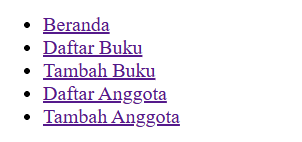
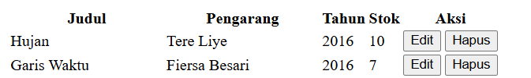
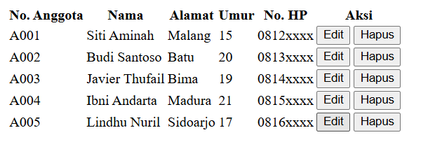
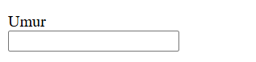

# Ide Latihan Tambahan (Opsional)
Untuk memperdalam pemahaman, coba lakukan sendiri (tidak wajib, tapi sangat disarankan untuk latihan):

1. Lengkapi konsistensi menu — tambahkan tautan "Daftar Anggota" dan "Tambah Anggota" ke menu <nav> di index.html, buku/list.html, dan buku/tambah.html (lihat catatan di dokumentasi anggota/list.html §5.4).  
**Jawaban:**
```bash
    <li><a href="index.html">Beranda</a></li>
    <li><a href="buku/list.html">Daftar Buku</a></li>
    <li><a href="buku/tambah.html">Tambah Buku</a></li>
    <li><a href="anggota/list.html">Daftar Anggota</a></li>
    <li><a href="Anggota/tambah.html">Tambah Anggota</a></li>
```
Outputnya:  
  

2. Tambah 2 baris data buku baru di buku/list.html dengan meng-copy satu blok ``<tr>...</tr>`` lalu mengganti isinya.  
**Jawaban:**
```bash
     <tr>
         <td>Hujan</td>
         <td>Tere Liye</td>
         <td>2016</td>
         <td>10</td>
         <td>
             <button type="button">Edit</button>
             <button type="button">Hapus</button>
         </td>
     </tr>
     <tr>
         <td>Garis Waktu</td>
         <td>Fiersa Besari</td>
         <td>2016</td>
         <td>7</td>
         <td>
             <button type="button">Edit</button>
             <button type="button">Hapus</button>
         </td>
     </tr>
```
Outputnya:  
  

3. Tambah kolom baru di tabel anggota, misalnya "Tanggal Bergabung", lengkap dengan <th> dan <td>-nya di setiap baris.  
**Jawaban:**
```bash
        <tr>
            <th>No. Anggota</th>
            <th>Nama</th>
            <th>Alamat</th>
            <th>Umur</th>
            <th>No. HP</th>
            <th>Aksi</th>
        </tr>
    </thead>
    <tbody>
        <tr>
            <td>A001</td>
            <td>Siti Aminah</td>
            <td>Malang</td>
            <td>15</td>
            <td>0812xxxx</td>
            <td>
                <button type="button">Edit</button>
                <button type="button">Hapus</button>
            </td>
        </tr>

```
Outputnya:  
  

4. Tambah field baru di form tambah anggota, misalnya "Email" memakai ``` <input type="email"> ``` (type="email" otomatis memvalidasi format alamat email tanpa perlu JavaScript tambahan).  
**Jawaban:**
```bash
    <p>
        <label for="umur">Umur</label><br>
        <input type="text" id="umur" name="umur">
    </p>
```
Outputnya:  
