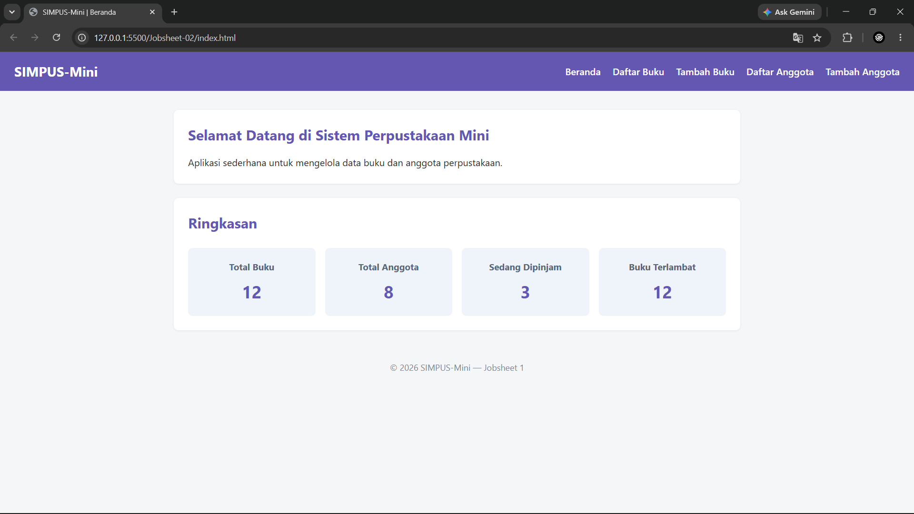
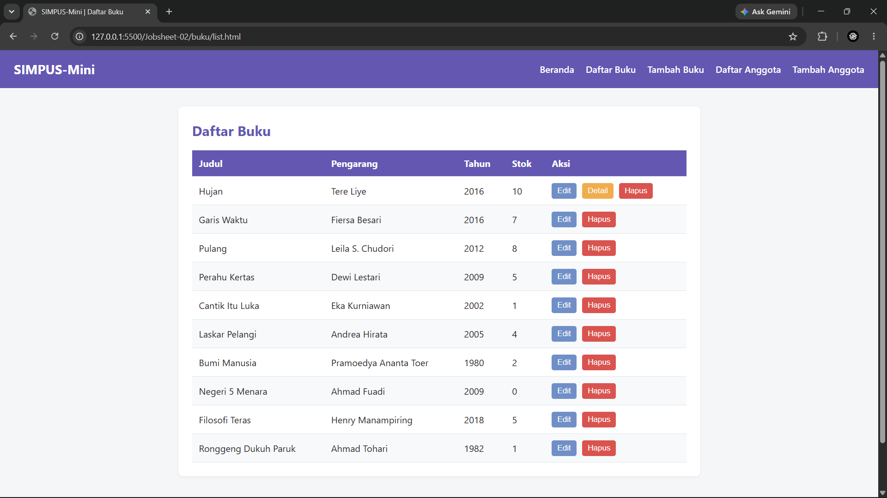
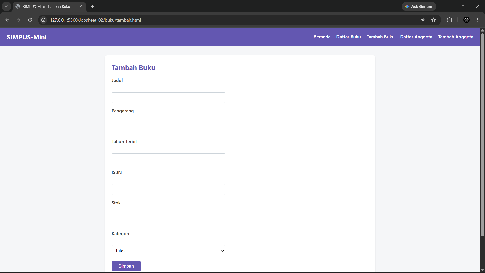
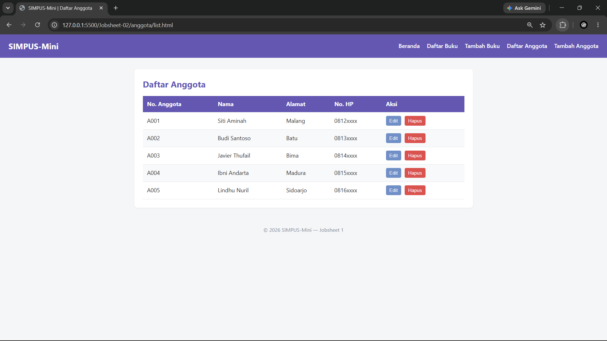
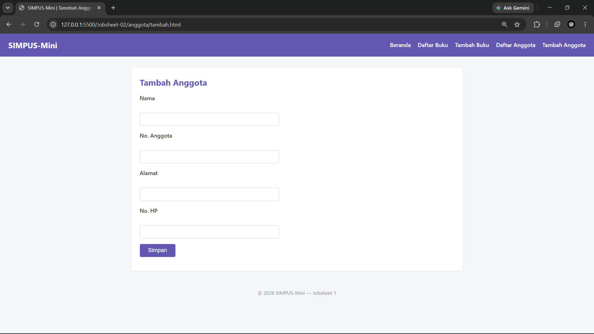

| | |
| :--- | :--- |
| **Mata Kuliah** | : Desain dan Pemrograman Web |
| **Program Studi** | : D4 – Teknik Informatika |
| **Semester** | : 3 |

---

| | |
| :--- | :--- |
| **Kelas** | : TI-2D |
| **NIM** | : 254107020019 |
| **Nama** | : M. Javier Thufail |
| **Jobsheet Ke-** | : 2 |

# LAPORAN JOBSHEET

### **1. Keterangan Kode HTML**
> **Catatan:** Seluruh struktur markup HTML pada praktikum Jobsheet 2 ini mengulang dan mengimplementasikan kode dari **Jobsheet 1**. Penjelasan detail mengenai elemen-elemen HTML (`<nav>`, `<table>`, `<form>`, dll.) telah dijelaskan secara lengkap pada laporan **Jobsheet 1**.

---

### **2. Kode CSS (`style.css`)**

```bash
/* ===== Reset & Base ===== */
* {
    box-sizing: border-box;
    margin: 0;
    padding: 0;
}

body {
    font-family: "Segoe UI", Arial, sans-serif;
    color: #2b2b2b;
    background-color: #f5f6f8;
    line-height: 1.5;
}

a {
    color: #1d5b8a;
    text-decoration: none;
}

a:hover {
    text-decoration: underline;
}

/* ===== Header & Navbar (Flexbox) ===== */
header {
    background-color: rgb(99, 87, 177);
    color: #fff;
    padding: 1rem 1.5rem;
    display: flex;
    align-items: center;
    justify-content: space-between;
    flex-wrap: wrap;
}

header h1 {
    font-size: 1.4rem;
}

header nav ul {
    list-style: none;
    display: flex;
    gap: 1.25rem;
}

header nav a {
    color: #fff;
    font-weight: 500;
}

/* ===== Main Layout ===== */
main {
    max-width: 1000px;
    margin: 2rem auto;
    padding: 0 1.5rem;
}

section {
    background-color: #fff;
    border-radius: 8px;
    padding: 1.5rem;
    margin-bottom: 1.5rem;
    box-shadow: 0 1px 3px rgba(0, 0, 0, 0.08);
}

section h2 {
    margin-bottom: 1rem;
    color: rgb(99, 87, 177);
}

/* ===== Kartu Statistik (CSS Grid) ===== */
main section:nth-of-type(2) {
    display: flex;
    flex-wrap: wrap;
    grid-template-columns: repeat(4, 1fr);
    gap: 1rem;
}

main section:nth-of-type(2) article {
    background-color: #eef4fa;
    border-radius: 8px;
    padding: 1.25rem;
    text-align: center;
    flex: 1;
}

main section:nth-of-type(2) h2 {
    width: 100%;
    margin-bottom: 0.5rem;
}

main section:nth-of-type(2) article h3 {
    font-size: 0.95rem;
    color: #55677a;
    margin-bottom: 0.5rem;
    grid-column: 1 / -1;
}

main section:nth-of-type(2) article p {
    font-size: 1.8rem;
    font-weight: 700;
    color: rgb(99, 87, 177);
}

/* ===== Tabel ===== */
table {
    width: 100%;
    border-collapse: collapse;
}

th,td {
    text-align: left;
    padding: 0.65rem 0.75rem;
    border-bottom: 1px solid #e2e6ea;
}

thead {
    background-color: rgb(99, 87, 177);
    color: #fff;
}

tbody tr:nth-child(even) {
    background-color: #f7f9fb;
}

tbody tr:hover {
    background-color: #eef4fa;
}

td button {
    padding: 0.35rem 0.6rem;
    margin-right: 0.35rem;
    border: none;
    border-radius: 4px;
    cursor: pointer;
    font-size: 0.85rem;
}

td button:first-of-type {
    background-color: #708fc6;
    color: #fff;
}

td button:nth-of-type(2) {
  background-color: #f0ad4e;
  color: #fff;
}

td button:last-of-type {
    background-color: #d9534f;
    color: #fff;
}

/* ===== Form ===== */
form p {
    margin-bottom: 1rem;
}

form label {
    display: block;
    margin-bottom: 0.35rem;
    font-weight: 600;
    color: #444;
}

form input, 
form select {
    width: 100%;
    max-width: 400px;
    padding: 0.55rem 0.7rem;
    border: 1px solid #cdd4da;
    border-radius: 4px;
    font-size: 1rem;
}

form button[type="submit"] {
    background-color: rgb(99, 87, 177);
    color: #fff;
    border: none;
    padding: 0.6rem 1.5rem;
    border-radius: 4px;
    font-size: 1rem;
    cursor: pointer;
}

form button[type="submit"]:hover {
    background-color: rgb(40, 36, 67);
}

/* ===== Footer ===== */
footer {
    text-align: center;
    padding: 1.25rem;
    color: #7a8794;
    font-size: 0.9rem;
}
```
### **Penjelasan**

* **Reset & Base (`*`, `body`, `a`):** Mengosongkan *margin*/*padding* bawaan browser, mengatur tipe font `Segoe UI`, warna latar belakang (`#f5f6f8`), serta gaya default tautan (*link*).
* **Header & Navbar (`header`, `nav`):** Menggunakan `display: flex` untuk menata posisi judul dan daftar navigasi secara sejajar ke samping dengan warna latar belakang ungu (`rgb(99, 87, 177)`).
* **Tata Letak Utama (`main`, `section`):** Membatasi lebar konten maksimal `1000px` di tengah layar (*center*) serta membungkus tiap bagian dalam bentuk *card* putih berbayang (`box-shadow`).
* **Kartu Statistik (`article`):** Mengatur tata letak kartu ringkasan angka menggunakan Flexbox agar responsif dan membagi ruang secara seimbang (`flex: 1`).
* **Styling Tabel (`table`, `thead`, `tbody`):** Memberikan warna ungu pada header tabel, garis pembatas antar-sel, warna zebra/belang-seling pada baris genap (`tr:nth-child(even)`), serta efek sorot (`hover`).
* **Tombol Aksi (`button`):** Mewarnai tombol aksi pada tabel dengan skema warna khusus (Biru untuk Detail, Kuning untuk Edit, Merah untuk Hapus).
* **Styling Formulir (`form`):** Merapikan tata letak *label* dan *input* agar berukuran penuh (maksimal `400px`) serta menambahkan efek *hover* pada tombol *submit*.

### **Output**
#### **a. Beranda**


#### **b. Daftar Buku**


#### **c. Tambah Buku**


#### **d. Daftar Anggota**


#### **e. Tambah Anggota**
