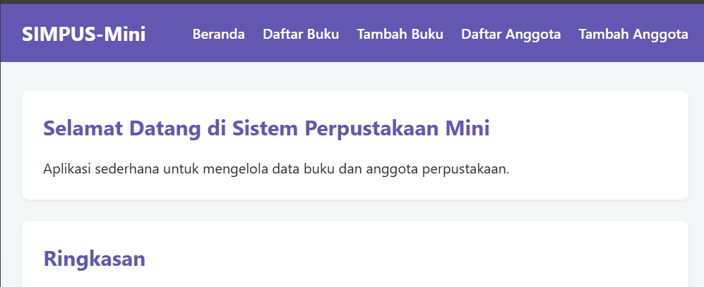
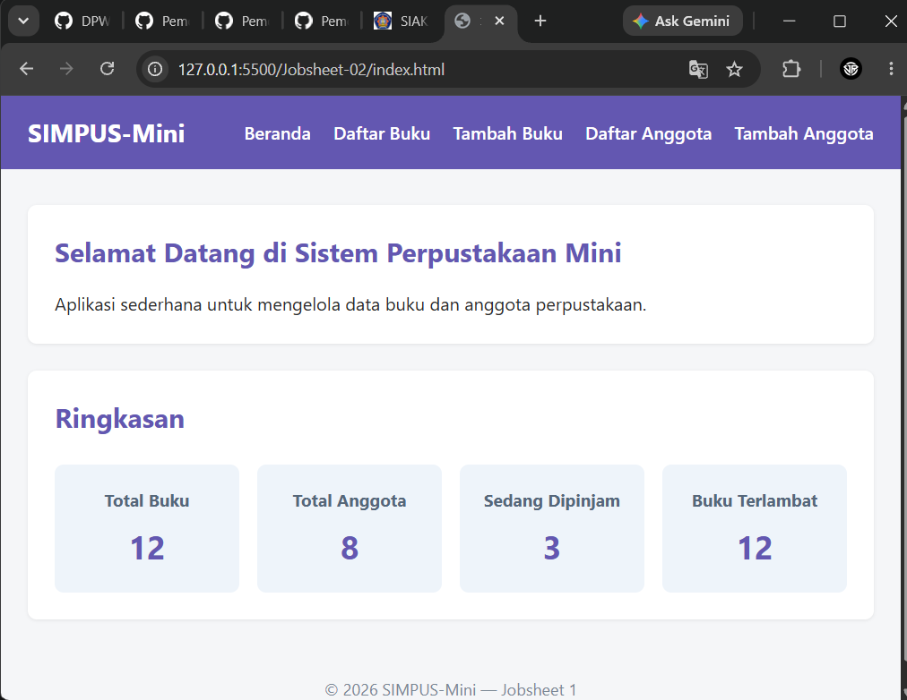
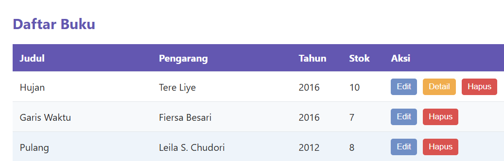
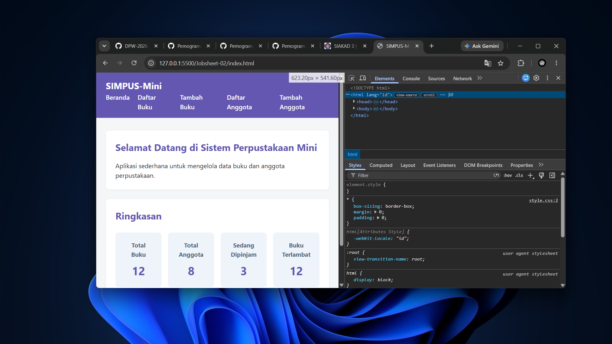

## Ide Latihan Tambahan (Opsional)
1. Ubah skema warna — ganti nilai #1d5b8a (warna biru tema) di seluruh file style.css dengan warna lain, misalnya hijau tua, lalu amati bagaimana warna itu konsisten muncul di header, judul section, tombol submit, dan header tabel — karena semuanya memakai nilai hex yang sama.  
**Jawaban:**
```bash
    background-color: rgb(99, 87, 177);
```
Outputnya:      


2. Tambah kolom keempat di grid kartu statistik — tambahkan satu <article> baru di HTML (misalnya "Buku Terlambat"), lalu ubah repeat(3, 1fr) menjadi repeat(4, 1fr) di CSS.  
**Jawaban:**  

HTML:
```bash
    <article>
        <h3>Buku Terlambat</h3>
        <p>12</p>
    </article>
```  
CSS:
```bash
main section:nth-of-type(2) {
    display: flex;
    flex-wrap: wrap;
    grid-template-columns: repeat(4, 1fr);
    gap: 1rem;
}
```
Outputnya:  
  

3. Buat tombol ketiga di tabel — tambahkan tombol "Detail" di antara Edit dan Hapus pada buku/list.html, lalu amati apakah warnanya sesuai harapan (ingat catatan di bab 7 §7.6 tentang :first-of-type/:last-of-type yang berbasis posisi, bukan makna). Coba perbaiki dengan memberi class khusus jika warnanya tidak sesuai.  
**Jawaban:**  

HTML:   
```bash
    <td>
        <button type="button">Edit</button>
        <button type="button">Detail</button>
        <button type="button">Hapus</button>
    </td>
```
CSS:  
```bash
td button:nth-of-type(2) {
      background-color: #f0ad4e;
      color: #fff;
    }
```  
Outputnya:  
  

4. Uji responsivitas sederhana — perkecil lebar jendela browser secara bertahap sampai sangat sempit (seperti lebar HP), amati kapan flex-wrap: wrap pada navbar mulai memindahkan menu ke baris baru.  
**Jawaban:**  

