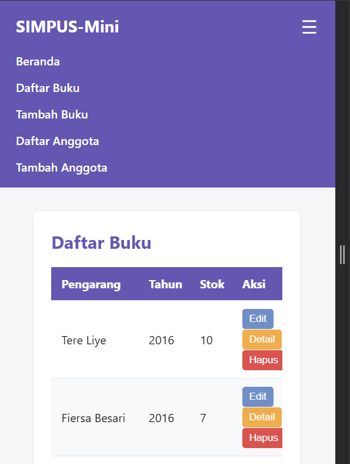
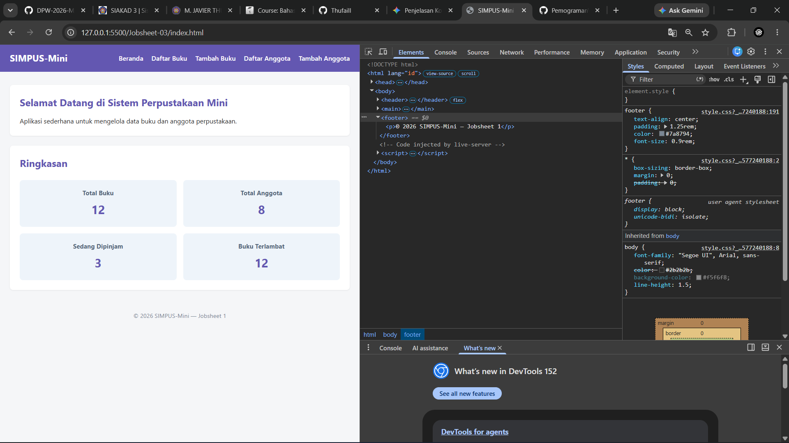

| | |
| :--- | :--- |
| **Mata Kuliah** | : Desain dan Pemrograman Web |
| **Program Studi** | : D4 – Teknik Informatika |
| **Semester** | : 3 |

---

| | |
| :--- | :--- |
| **Kelas** | : TI-2D |
| **NIM** | : 254107020019 |
| **Nama** | : M. Javier Thufail |
| **Jobsheet Ke-** | : 2 |

# LAPORAN JOBSHEET

### **1. Kode HTML**

```bash
    <input type="checkbox" id="nav-toggle" class="nav-toggle">
    <label for="nav-toggle" class="nav-toggle-label">&#9776;</label>
```
### **Penjelasan:**
- ```<input type="checkbox">```: Sakelar tersembunyi yang menyimpan status apakah menu sedang terbuka atau tertutup.

- ```<label>```: Tombol pemicu (toggle) yang menampilkan ikon hamburger (```&#9776;``` merender simbol ☰). Atribut for="nav-toggle" menghubungkannya langsung ke elemen ```<input>``` dengan ID yang sama.
---

### **2. Kode CSS**

```bash
    /* ===== Elemen Responsif (Table & Code Block) ===== */
    .table-responsive,
    .code-responsive,
    pre {
        overflow-x: auto;
        max-width: 100%;
        display: block;
    }

    pre code {
        white-space: pre;  /* Menjaga agar teks kode tidak terpotong ke bawah */
    }

    /* ===== Hamburger Menu (checkbox hack) ===== */
    .nav-toggle {
        display: none;
    }

    .nav-toggle-label {
        display: none;
        font-size: 1.6rem;
        color: #fff;
        cursor: pointer;
    }

    /* ===== Responsive Breakpoints ===== */

    @media (min-width: 1400px) {
        main {
            max-width: 1000px;
        }
    }

    /* Tablet ke bawah */
    @media (max-width: 900px) {
        main section:nth-of-type(2) {
            grid-template-columns: repeat(2, 1fr);
        }
    }

    /* Mobile */
    @media (max-width: 480px) {
        header {
            position: relative;
        }

        .nav-toggle-label {
            display: block;
        }

        header nav {
            display: none;
            width: 100%;
            order: 3;
            margin-top: 1rem;
        }

        .nav-toggle:checked ~ nav {
            display: block;
        }

        header nav ul {
            flex-direction: column;
            gap: 0.75rem;
        }

        main section:nth-of-type(2) {
            grid-template-columns: 1fr;
        }

        form input,
        form select {
            max-width: 100%;
        }
    }
```

### **Penjelasan**
- **overflow-x: auto:** Mencegah tampilan halaman rusak ketika teks kode atau tabel terlalu lebar. Jika isi melampaui lebar layar, bilah gulir (scrollbar) horizontal akan muncul.
- max-width: 100%: Mencegah elemen melebar melampaui lebar wadah (container) utamanya.
- white-space: pre: Mempertahankan format spasi, tab, dan baris baru bawaan dari teks kode
- .nav-toggle: Menyembunyikan elemen ```<input type="checkbox">``` asli dari layar agar tidak mengganggu tampilan.
- .nav-toggle-label: Menyembunyikan tombol ikon hamburger secara default pada layarmonitor/desktop besar.
- Menargetkan layar monitor sangat lebar (minimal 1400px).
- max-width: 1000px: Membatasi lebar area konten utama (main) di tengah layar agar tidak membentang terlalu panjang.
- Menargetkan layar ukuran tablet ke bawah (maksimal 900px).
- grid-template-columns: repeat(2, 1fr): Mengubah tata letak grid pada section kedua menjadi 2 kolom yang sejajar.
- Menargetkan layar ponsel/HP (maksimal 480px).
- .nav-toggle-label { display: block; }: Menampilkan ikon hamburger untuk membuka menu.
- header nav { display: none; }: Menyembunyikan daftar navigasi secara default saat awal dibuka.
- .nav-toggle:checked ~ nav { display: block; }: Konsep Checkbox Hack—menampilkan menu navigasi ketika ikon hamburger (checkbox) di-klik/dicentang.
- flex-direction: column: Mengubah urutan daftar tautan menu dari mendatar menjadi berderet ke bawah (vertikal).
- grid-template-columns: 1fr: Mengubah layout section kedua menjadi 1 kolom penuh agar muat di layar kecil.
- max-width: 100%: Memastikan kolom input formulir tidak melar keluar dari layar ponsel.
### **Output**
  
