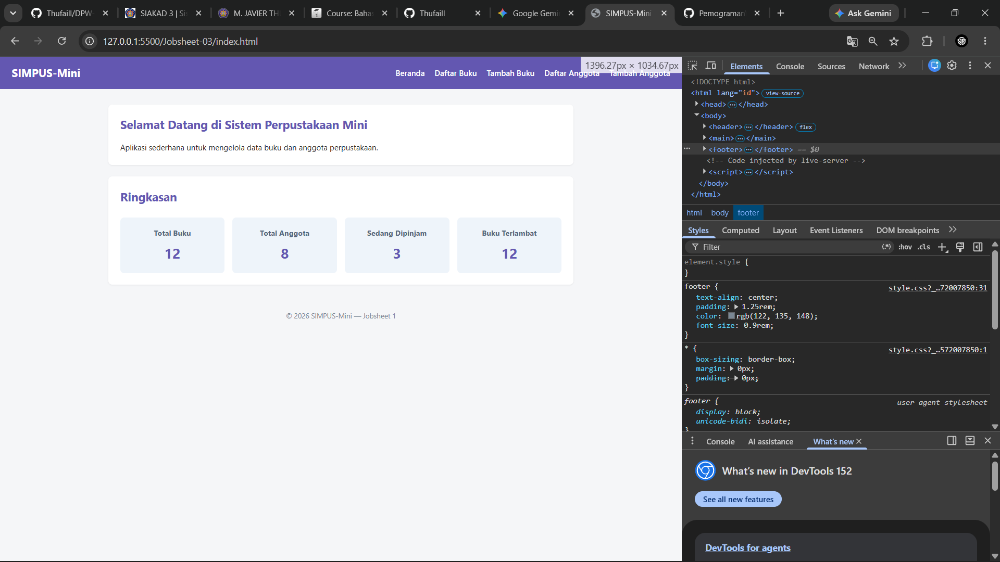
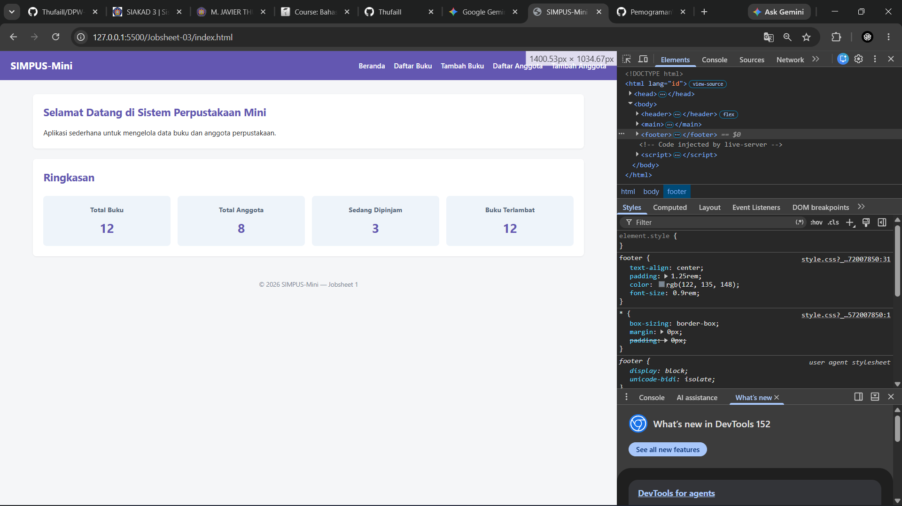
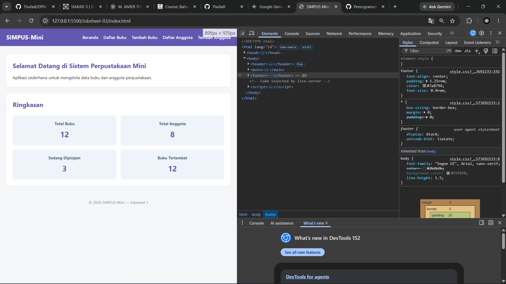

## Ide Latihan Tambahan (Opsional)

1. **Tambah breakpoint baru** — misalnya `@media (min-width: 1400px)`
   untuk layar monitor sangat lebar, ubah `main { max-width: 1000px; }`
   (dari dokumentasi jobsheet-02) menjadi lebih lebar khusus di breakpoint ini.
   ```bash
      @media (min-width: 1400px) {
       main {
           max-width: 1000px;
         }
      }
   ```
   Outputnya:  
   
   
2. **Ubah breakpoint tablet** dari `768px` menjadi `900px`, lalu amati
   di lebar layar berapa susunan kartu berubah — buktikan bahwa breakpoint
   memang bisa disesuaikan bebas sesuai kebutuhan desain.
   **Jawaban:**
   ```bash
   @media (max-width: 900px) {
   ```
   Outputnya:  
   
3. **Terapkan pola `table-responsive`** ke elemen lain yang berpotensi
   melebar di layar sempit, misalnya kalau suatu saat kamu menambahkan
   blok kode `<pre>` yang panjang di salah satu halaman.
   **Jawaban:**
   ```bash
      .table-responsive,
      .code-responsive,
      pre {
      overflow-x: auto;
      max-width: 100%;
      display: block;
      }

      pre code {
      white-space: pre; /* Menjaga agar teks kode tidak terpotong ke bawah */
}
   ```
4. **Ubah posisi ikon hamburger** — misalnya pindahkan `.nav-toggle-label`
   ke urutan terakhir di `<header>` (setelah `<nav>`) lalu amati apakah
   sibling combinator `.nav-toggle:checked ~ nav` di
   (bab 3 §3.5) masih bekerja — ingat catatan bahwa combinator `~` mensyaratkan
   target berada **setelah** elemen sumbernya di HTML.
   **Jawaban:**
   ```bash
       <header>
        <h1>SIMPUS-Mini</h1>
        <nav>
            <ul>
                <li><a href="index.html">Beranda</a></li>
                <li><a href="Buku/list.html">Daftar Buku</a></li>
                <li><a href="Buku/tambah.html">Tambah Buku</a></li>
                <li><a href="Anggota/list.html">Daftar Anggota</a></li>
                <li><a href="Anggota/tambah.html">Tambah Anggota</a></li>
            </ul>
            <input type="checkbox" id="nav-toggle" class="nav-toggle">
            <label for="nav-toggle" class="nav-toggle-label">&#9776;</label>
        </nav>
    </header>
   ```
   Penjelasn:  
   Berdasarkan kode HTML tersebut, hamburger menu tidak akan berfungsi karena aturan sibling combinator (.nav-toggle:checked ~ nav) mengharuskan elemen sumber ```<input class="nav-toggle">``` diletakkan sebelum elemen target ```<nav>``` dalam urutan dokumen. Pada struktur kode di atas, elemen ```<nav>``` ditulis lebih dulu daripada ```<input>```, sehingga CSS gagal menjangkau dan menampilkan menu saat checkbox dicentang; solusi tepatnya adalah tetap menempatkan elemen ```<input>``` di sebelum ```<nav>```, sedangkan ```<label> (ikon &#9776;)``` bebas diletakkan di akhir header setelah ```<nav>``` karena hubungannya diikat oleh atribut for="nav-toggle".  

5. **Bandingkan dengan pendekatan mobile-first** — coba tulis ulang
   `style.css` dari nol memakai `@media (min-width: ...)` alih-alih
   `max-width`, dan rasakan sendiri bedanya alur berpikirnya.
   **Jawaban:**  
   ```bash
      /* --- Tablet (lebar >= 600px) --- */
      @media (min-width: 600px) {
          main {
              padding: 0 1.5rem;
          }

          /* Kartu statistik berubah dari 1 kolom menjadi 2 kolom */
          main section:nth-of-type(2) {
              grid-template-columns: repeat(2, 1fr);
          }

          /* Form input diberi batas lebar maksimal di layar sedang */
          form input,
          form select {
              max-width: 400px;
          }
      }

      /* --- Laptop / Desktop (lebar >= 900px) --- */
      @media (min-width: 900px) {
          main {
              max-width: 1000px;
              margin: 2rem auto;
          }

          /* Sembunyikan ikon hamburger */
          .nav-toggle-label {
              display: none;
          }

          /* Kembalikan navigasi desktop */
          header nav {
              display: block;
              width: auto;
              order: initial;
              margin-top: 0;
          }

          header nav ul {
              flex-direction: row;
              gap: 1.25rem;
          }

          /* Kartu statistik berubah menjadi 4 kolom */
          main section:nth-of-type(2) {
              grid-template-columns: repeat(4, 1fr);
          }
      }

      /* --- Large Desktop (lebar >= 1400px) --- */
      @media (min-width: 1400px) {
          main {
              max-width: 1300px;
          }
      }
   ```
   Penjelasan:  
   Pendekatan mobile-first berfokus pada efisiensi dengan menyusun style dasar untuk layar kecil tanpa layout kompleks, lalu secara bertahap menambahkan properti seperti Grid atau Flexbox menggunakan @media (min-width: ...) seiring bertambahnya lebar layar—berbeda dari desktop-first yang harus sibuk mereset atau menghapus style rumit saat layar mengecil.