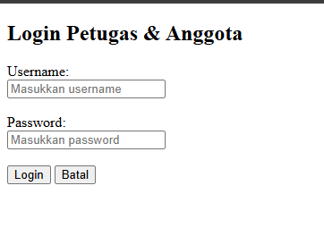

## Ide Latihan Tambahan (Opsional)
## 6.4 Ide Latihan Tambahan (Opsional)

1. **Gambar wireframe halaman baru** memakai konvensi ASCII yang sama
    ([bab 2 §2.2](02-cara-membaca-wireframe.md#22-aturan-membaca-simbol-simbolnya)) —
    misalnya halaman "Registrasi Anggota Baru" untuk aktor Tamu yang
    ingin jadi anggota perpustakaan.  
    **Jawaban:**
```
    +-----------------------------------------------------------------------+
    |  PERPUSTAKAAN DIGITAL                              [ Home ] [ Login ] |
    +-----------------------------------------------------------------------+
    |                                                                       |
    |  REGISTRASI ANGGOTA BARU                                              |
    |  ------------------------------------------------                     |
    |  Silakan isi formulir di bawah ini untuk mendaftar sebagai anggota.   |
    |                                                                       |
    |  [ Nomor Identitas / NIM ]                                            |
    |  +-----------------------------------------------------------------+  |
    |  | e.g. 2341720000                                                 |  |
    |  +-----------------------------------------------------------------+  |
    |                                                                       |
    |  [ Nama Lengkap ]                                                     |
    |  +-----------------------------------------------------------------+  |
    |  | Masukkan nama lengkap sesuai kartu identitas                    |  |
    |  +-----------------------------------------------------------------+  |
    |                                                                       |
    |  [ Alamat Email ]                                                     |
    |  +-----------------------------------------------------------------+  |
    |  | contoh@email.com                                                |  |
    |  +-----------------------------------------------------------------+  |
    |                                                                       |
    |  [ Nomor Telepon / WA ]                                               |
    |  +-----------------------------------------------------------------+  |
    |  | 081234567890                                                    |  |
    |  +-----------------------------------------------------------------+  |
    |                                                                       |
    |  [ Submit Pendaftaran ]    [ Batal ]                                  |
    |                                                                       |
    +-----------------------------------------------------------------------+
    |  © 2026 Perpustakaan Digital                                          |
    +-----------------------------------------------------------------------+
```
2. **Buat user flow baru** untuk skenario yang belum digambarkan di
    `wireframe.md`, misalnya: "Petugas mencari anggota yang tunggakannya
    sudah lewat jatuh tempo."  
    **Jawaban:**
```
    [ Start ]
        │
        ▼
    [ Petugas Login ]
        │
        ▼
    [ Halaman Dashboard Petugas ]
        │
        ▼
    [ Pilih Menu "Data Peminjaman" ]
        │
        ▼
    [ Terapkan Filter: "Status = Terlambat / Lewat Jatuh Tempo" ]
        │
        ▼
    < Apakah ada data anggota terlambat? >
        ├── YA  ──> [ Tampilkan Daftar Anggota, Detail Hari Terlambat, & Denda ]
        └── TIDAK ─> [ Tampilkan Pesan: "Tidak ada data peminjaman terlambat" ]
        │
        ▼
    [ Selesai / Petugas dapat mencetak atau mengirim notifikasi ]
```
3. **Identifikasi edge case tambahan** yang mungkin belum tercatat,
    contoh: apa yang terjadi kalau Petugas mencoba meminjamkan buku yang
    sama ke anggota yang sama dua kali berturut-turut?  
    **Jawaban:**
    - Masalah: Terjadi transaksi duplicate borrowing (peminjaman ganda) untuk satu judul/eksamplar buku yang sama oleh satu anggota yang sama sebelum buku tersebut dikembalikan.

    - Aturan Bisnis (Business Rule):
        1. Sistem harus memeriksa status peminjaman aktif anggota tersebut di database.
        2. Jika anggota masih memiliki status Dipinjam untuk ID buku/katalog yang sama, sistem menolak transaksi baru tersebut.

    - Solusi Penanganan (UI/UX Response):
        * Tampilkan pesan peringatan/error pada form peminjaman:
            > "Gagal: Anggota ini masih meminjam buku yang sama dan belum mengembalikannya."

    - Batasi penginputan sistem agar tombol submit terblokir sampai kriteria terpenuhi.
4. **Coba implementasikan wireframe Login sebagai HTML statis** (tanpa
    logika login sungguhan, mirip form Tambah Buku yang belum diproses
    di jobsheet-01) sebagai latihan menerjemahkan wireframe ke kode
    nyata — gunakan pola `<label>` + `<input>` yang sudah kamu kuasai
    dari [dokumentasi jobsheet-01](../../jobsheet-01/Dokumentasi/04-buku-tambah-html.md),
    ditambah satu `<input type="password">` baru untuk field Password.  
    **Jawaban:**
    ```bash
            <!DOCTYPE html>
        <html lang="id">
        <head>
            <meta charset="UTF-8">
            <meta name="viewport" content="width=device-width, initial-scale=1.0">
            <title>Halaman Login - Perpustakaan</title>
        </head>
        <body>

            <h2>Login Petugas & Anggota</h2>

            <form action="#" method="POST">
                <div>
                    <label for="username">Username:</label><br>
                    <input type="text" id="username" name="username" placeholder="Masukkan username" required>
                </div>

                <br>

                <div>
                    <label for="password">Password:</label><br>
                    <input type="password" id="password" name="password" placeholder="Masukkan password" required>
                </div>

                <br>

                <div>
                    <button type="submit">Login</button>
                    <button type="reset">Batal</button>
                </div>
            </form>

        </body>
        </html>
    ```  
    **Outputnya:**  
    