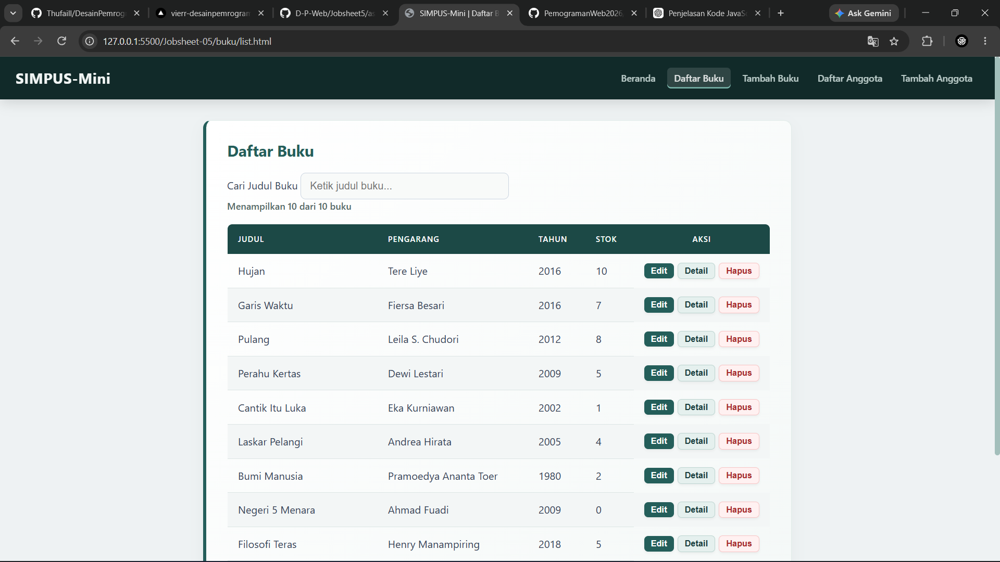
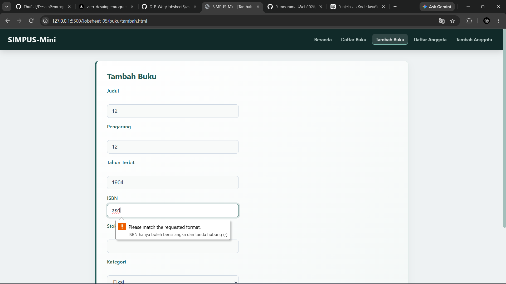

| | |
| :--- | :--- |
| **Mata Kuliah** | : Desain dan Pemrograman Web |
| **Program Studi** | : D4 – Teknik Informatika |
| **Semester** | : 3 |

---

| | |
| :--- | :--- |
| **Kelas** | : TI-2D |
| **NIM** | : 254107020019 |
| **Nama** | : M. Javier Thufail |
| **Jobsheet Ke-** | : 2 |

# LAPORAN JOBSHEET
## Penjelasan Kode JavaScript

JavaScript ini digunakan untuk mengatur beberapa fitur pada website perpustakaan, yaitu:

### 1. Update Counter Tabel
Fungsi `updateTableCounter()` digunakan untuk menghitung jumlah buku yang ada di tabel dan jumlah buku yang sedang ditampilkan.

Contoh hasil:
`Menampilkan 5 dari 10 buku`

### 2. Hamburger Menu
Fungsi `initNavToggle()` digunakan untuk membuka dan menutup menu navigasi ketika tombol hamburger diklik.

`classList.toggle("nav-open")` digunakan untuk menambah atau menghapus class `nav-open`.

### 3. Konfirmasi Hapus
Fungsi `initHapusConfirm()` digunakan untuk memberikan konfirmasi sebelum data buku dihapus.

Jika pengguna memilih **OK**, baris buku akan dihapus dari tabel menggunakan `row.remove()`.

Penghapusan ini hanya pada tampilan halaman dan belum menghapus data dari database.

### 4. Filter/Pencarian Buku
Fungsi `initTableFilter()` digunakan untuk mencari buku berdasarkan **judul**.

Jika judul sesuai dengan kata yang dicari, baris ditampilkan. Jika tidak sesuai, baris disembunyikan.

Setelah pencarian, `updateTableCounter()` dipanggil untuk memperbarui jumlah buku yang tampil.

### 5. Validasi Form
Fungsi `initValidasiForm()` digunakan untuk memeriksa data sebelum form dikirim.

Aturan validasinya:
- Judul/Nama tidak boleh kosong.
- Pengarang tidak boleh kosong.
- Tahun harus 1900–2026.
- Stok tidak boleh negatif.
- ISBN hanya boleh berisi angka dan tanda `-`.

Jika data tidak valid, `e.preventDefault()` digunakan untuk mencegah form dikirim.

### 6. DOMContentLoaded
Bagian `DOMContentLoaded` digunakan untuk menjalankan semua fungsi JavaScript setelah halaman HTML selesai dimuat.

Fungsi yang dijalankan:
- `initNavToggle()`
- `initHapusConfirm()`
- `initTableFilter()`
- `initValidasiForm()`
- `updateTableCounter()`

### Kesimpulan

Kode JavaScript ini berfungsi untuk membuat website lebih interaktif, terutama pada **menu navigasi, pencarian buku, penghapusan data, penghitung jumlah buku, dan validasi form**.

## Outputnya  
  
