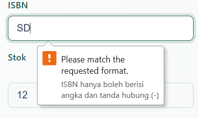
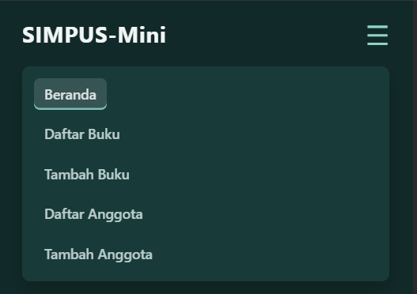
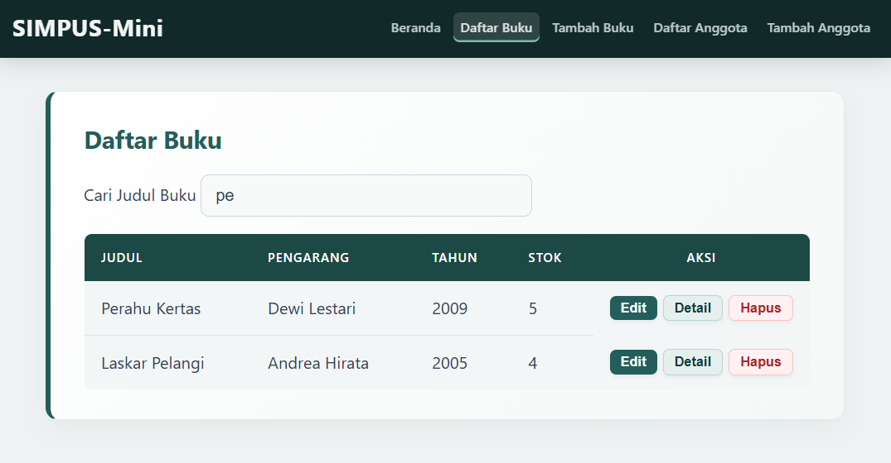
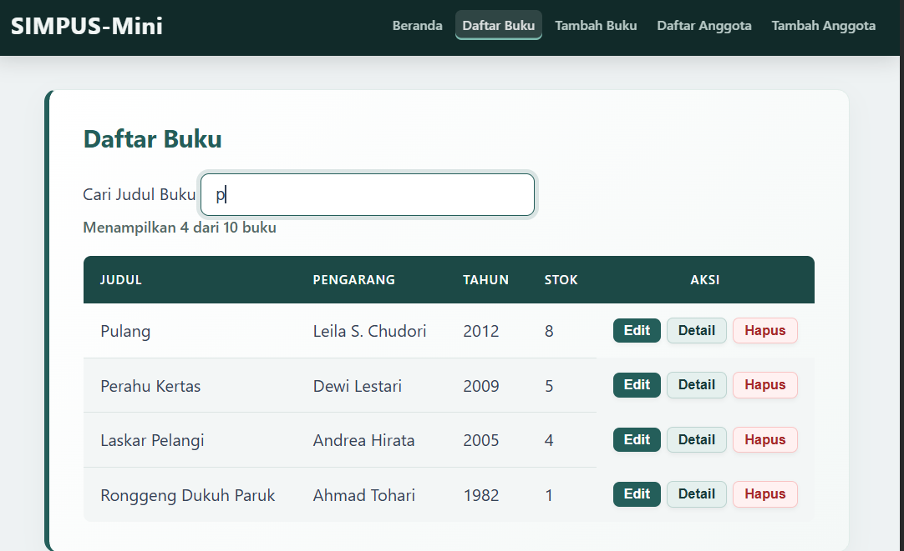

## 8.4 Ide Latihan Tambahan (Opsional)

1. **Tambah validasi field baru** — misalnya field ISBN di form Tambah
   Buku (yang saat ini tidak wajib diisi, ingat dari
   [dokumentasi jobsheet-01 §4.4])
   validasi supaya hanya menerima angka dan tanda hubung.
   **Jawaban:** 
    HTML CODE:
    ```bash
        <label for="isbn">ISBN</label>
        <input type="text" id="isbn" name="isbn" pattern="[0-9\-]+"
        title="ISBN hanya boleh berisi angka dan tanda hubung (-)">
    ```
    JS CODE:
    ```bash
        const isbn = form.querySelector("[name='isbn']");
        if (isbn && isbn.value.trim() !== "") {
            const regexIsbn = /^[0-9-]+$/;
            if (!regexIsbn.test(isbn.value.trim())) {
                tampilkanError(isbn, "ISBN hanya boleh berisi angka dan tanda hubung (-).");
                valid = false;
            } else {
                hapusError(isbn);
            }
        }
    ```
    Outputnya:  
     

2. **Tambah animasi sederhana** pada `initNavToggle` — misalnya
   tambahkan class CSS `transition` pada `header nav` di `style.css`
   supaya menu terbuka/tertutup dengan efek geser halus, alih-alih
   langsung muncul/hilang seketika.
   **Jawaban:**  
    ```bash
    /* Base Nav Mobile (Saat Tertutup) */
        header nav {
            display: block;
            width: 100%;
            order: 3;
            margin-top: 0;
            max-height: 0;
            opacity: 0;
            overflow: hidden;
            background: #183b3a;
            border-radius: 8px;
            box-shadow: 0 8px 20px rgba(0, 0, 0, 0.2);
            transition: max-height 0.35s ease-in-out, opacity 0.3s ease-in-out, margin-top 0.35s ease-in-out, padding 0.35s ease-in-out;
        }

    /* State Nav Mobile (Saat Terbuka via JS toggle .nav-open) */
        header nav.nav-open {
            max-height: 300px;
            opacity: 1;
            margin-top: 1rem;
            padding: 0.75rem;
        }

        header nav ul {
            flex-direction: column;
            gap: 0.5rem;
        }

        main section:nth-of-type(2) {
            grid-template-columns: 1fr;
        }

        form input,
        form select {
            max-width: 100%;
        }
    ```
    Outputnya:  
      
    Ketika hamburger button di tekan akan ada animasi geser terbuka dan tertutup.

3. **Perluas `initTableFilter`** supaya pencarian bisa dibatasi ke satu
   kolom saja (misalnya hanya kolom "Judul"), bukan mencari di seluruh
   teks baris — petunjuk: gunakan `row.querySelector("td")` seperti pola
   yang sudah dipakai di [bab 5 §5.4],
   alih-alih `row.textContent`.
   **Jawaban:**  
    ```bash
    // ===== Filter/pencarian tabel real-time (Hanya Kolom Judul) =====
        function initTableFilter() {
            const input = document.getElementById("search-input");
            const table = document.querySelector(".table-responsive table");
            if (!input || !table) return;

            input.addEventListener("keyup", function () {
                const keyword = input.value.toLowerCase();
                const rows = table.querySelectorAll("tbody tr");

                rows.forEach(function (row) {
                    // Ambil elemen td pertama (kolom Judul)
                    const kolomJudul = row.querySelector("td");
                    const teksJudul = kolomJudul ? kolomJudul.textContent.toLowerCase() : "";

                    // Tampilkan baris jika teks judul mengandung keyword
                    row.style.display = teksJudul.includes(keyword) ? "" : "none";
                });
            });
        }
    ```
    Outputnya:   
    

4. **Tambah counter jumlah baris tersisa** setelah difilter atau
   dihapus — tampilkan misalnya "Menampilkan 3 dari 5 buku" di atas
   tabel, diperbarui setiap kali `initTableFilter` atau
   `initHapusConfirm` berjalan.
   **Jawaban:**  
   HTML CODE:
    ```bash
        <p id="table-counter" class="table-counter">Menampilkan 0 dari 0 buku</p>
    ```
    JS CODE:
    ```bash
    // ===== Fungsi Pembantu: Update Counter Tabel =====
        function updateTableCounter() {
        const table = document.querySelector(".table-responsive table");
        const counterEl = document.getElementById("table-counter");
        if (!table || !counterEl) return;

        const allRows = table.querySelectorAll("tbody tr");
        const totalBuku = allRows.length;

    // Hitung baris yang tampil (tidak di-hide oleh filter)
        let visibleCount = 0;
        allRows.forEach(function (row) {
        if (row.style.display !== "none") {
            visibleCount++;
            }
        });

        counterEl.textContent = `Menampilkan ${visibleCount} dari ${totalBuku} buku`;
    }

        updateTableCounter();
    ```
    CSS CODE:
    ```bash
        .table-counter {
        font-size: 0.9rem;
        color: #526866;
        margin-bottom: 0.75rem;
        font-weight: 500;
        }
    ```
    Outputnya:  
    

5. **Refactor validasi** — coba ubah `initValidasiForm` supaya nama
   field yang wajib divalidasi diambil dari sebuah array/daftar,
   alih-alih menulis blok `if` terpisah untuk tiap field satu-satu
   (petunjuk: pikirkan pola perulangan `forEach` yang sudah dipakai di
   [bab 5] dan [bab 6]).
   **Jawaban:**
    ```bash
    // ===== Validasi form (client-side) - Refactored =====
        function tampilkanError(input, pesan) {
            hapusError(input);
            const span = document.createElement("span");
            span.className = "error";
            span.textContent = pesan;
            input.insertAdjacentElement("afterend", span);
        }

        function hapusError(input) {
            const next = input.nextElementSibling;
            if (next && next.classList.contains("error")) {
                next.remove();
            }
        }

        function initValidasiForm() {
            const form = document.getElementById("form-tambah");
            if (!form) return;

        // Daftar aturan validasi untuk tiap field
            const aturanValidasi = [
                {
                    selector: "[name='judul'], [name='nama']",
                    validate: (val) => val.trim() !== "",
                    pesan: "Field ini wajib diisi."
                },
                {
                    selector: "[name='pengarang']",
                    validate: (val) => val.trim() !== "",
                    pesan: "Pengarang wajib diisi."
                },
                {
                    selector: "[name='tahun']",
                    validate: (val) => {
                        const nilai = parseInt(val, 10);
                        return !isNaN(nilai) && nilai >= 1900 && nilai <= 2026;
                    },
                    pesan: "Tahun harus di antara 1900-2026."
                },
                {
                    selector: "[name='stok']",
                    validate: (val) => {
                        const nilai = parseInt(val, 10);
                        return !isNaN(nilai) && nilai >= 0;
                    },
                    pesan: "Stok tidak boleh negatif."
                },
                {
                    selector: "[name='isbn']",
                    validate: (val) => val.trim() === "" || /^[0-9-]+$/.test(val.trim()),
                    pesan: "ISBN hanya boleh berisi angka dan tanda hubung (-)."
                }
            ];

            form.addEventListener("submit", function (e) {
                let valid = true;

                // Perulangan untuk mengeksekusi aturan validasi
                aturanValidasi.forEach(({ selector, validate, pesan }) => {
                    const field = form.querySelector(selector);
                    if (!field) return;

                    if (!validate(field.value)) {
                        tampilkanError(field, pesan);
                        valid = false;
                    } else {
                        hapusError(field);
                    }
                });

                if (!valid) {
                    e.preventDefault();
                }
            });
        }
    ```