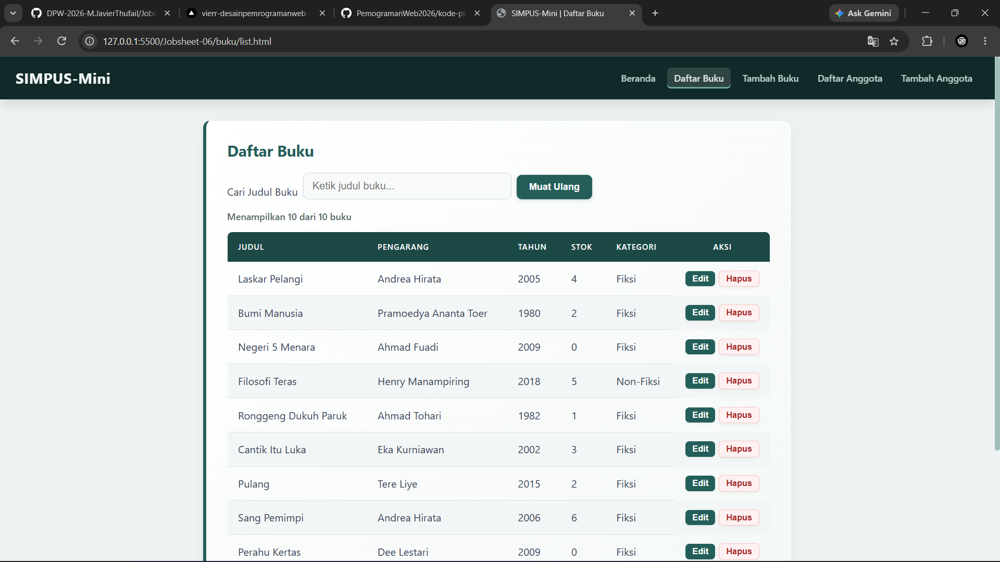
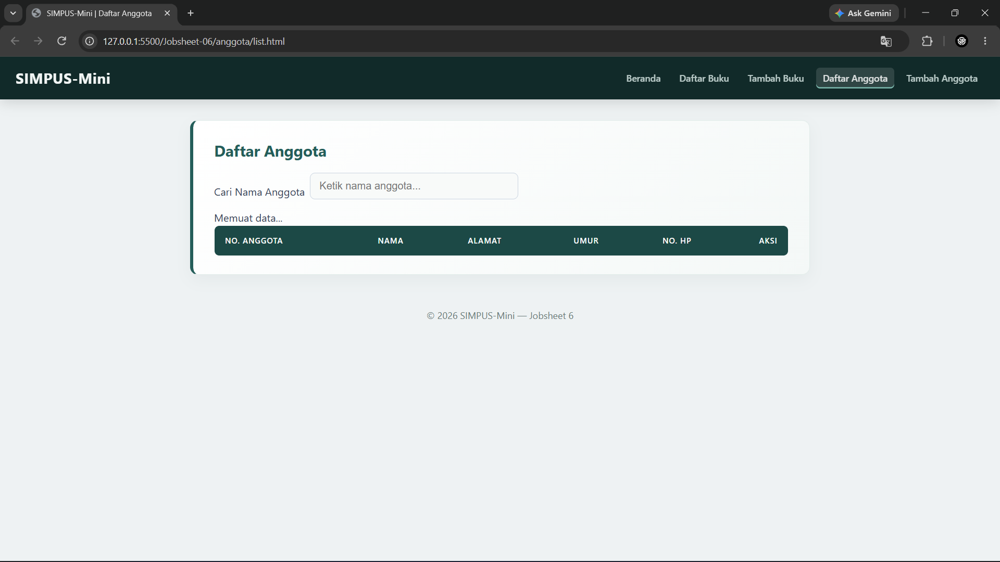

| | |
| :--- | :--- |
| **Mata Kuliah** | : Desain dan Pemrograman Web |
| **Program Studi** | : D4 – Teknik Informatika |
| **Semester** | : 3 |

---

| | |
| :--- | :--- |
| **Kelas** | : TI-2D |
| **NIM** | : 254107020019 |
| **Nama** | : M. Javier Thufail |
| **Jobsheet Ke-** | : 2 |

# LAPORAN JOBSHEET
# Penjelasan JavaScript dan JSON

## 1. assets/js/anggota.js

File `anggota.js` digunakan untuk mengambil data anggota dari file `anggota.json` dan menampilkannya ke dalam tabel.

### Proses kerja

1. `muatDaftarAnggota()` mengambil elemen tabel dan loading.
2. `fetch("../data/anggota.json")` mengambil data anggota dari file JSON.
3. `res.json()` mengubah data JSON menjadi data JavaScript.
4. `forEach()` melakukan perulangan untuk setiap data anggota.
5. `createElement("tr")` membuat baris tabel baru.
6. `appendChild()` menambahkan baris ke dalam tabel.
7. `try...catch` digunakan untuk menangani error.
8. `finally` digunakan untuk menghilangkan indikator loading setelah proses selesai.

Kode:

```javascript
document.addEventListener("DOMContentLoaded", muatDaftarAnggota);
```

Kode tersebut menjalankan fungsi `muatDaftarAnggota()` setelah halaman selesai dimuat.

---

## 2. assets/js/buku.js

File `buku.js` digunakan untuk mengambil dan menampilkan data buku ke dalam tabel.

```javascript
const kolomBuku = ["judul", "pengarang", "tahun", "stok", "kategori"];
```

Kode tersebut menentukan kolom data buku yang akan ditampilkan.

```javascript
function muatDaftarBuku() {
    muatDataTabel("buku.json", kolomBuku);
}
```

Fungsi `muatDaftarBuku()` memanggil fungsi `muatDataTabel()` untuk mengambil data dari `buku.json`.

```javascript
btnReload.addEventListener("click", muatDaftarBuku);
```

Kode tersebut membuat tombol **Reload** dapat digunakan untuk memuat ulang data buku.

---

## 3. data/anggota.json

File `anggota.json` digunakan untuk menyimpan data anggota perpustakaan dalam format JSON.

Data yang digunakan:

- `no_anggota` → nomor anggota
- `nama` → nama anggota
- `alamat` → alamat anggota
- `umur` → umur anggota
- `no_hp` → nomor HP anggota

Contoh data:

```json
{
    "no_anggota": "A001",
    "nama": "Javier Thufail",
    "alamat": "Bima",
    "umur": "19",
    "no_hp": "0811xxxx"
}
```

---

## 4. data/buku.json

File `buku.json` digunakan untuk menyimpan data buku perpustakaan dalam format JSON.

Data yang digunakan:

- `judul` → judul buku
- `pengarang` → nama pengarang
- `tahun` → tahun terbit
- `stok` → jumlah stok buku
- `kategori` → kategori buku

Contoh data:

```json
{
    "judul": "Laskar Pelangi",
    "pengarang": "Andrea Hirata",
    "tahun": 2005,
    "stok": 4,
    "kategori": "Fiksi"
}
```

---

## Kesimpulan

Secara keseluruhan, `anggota.js` dan `buku.js` digunakan untuk mengambil data dari file JSON dan menampilkannya ke halaman website.

- `anggota.js` → menampilkan data anggota.
- `buku.js` → menampilkan data buku.
- `anggota.json` → menyimpan data anggota.
- `buku.json` → menyimpan data buku.
- `fetch()` → mengambil data JSON.
- `forEach()` → melakukan perulangan data.
- `DOMContentLoaded` → menjalankan fungsi setelah halaman selesai dimuat.
- Tombol `Reload` → memuat ulang data buku.

## Outputnya  
  
