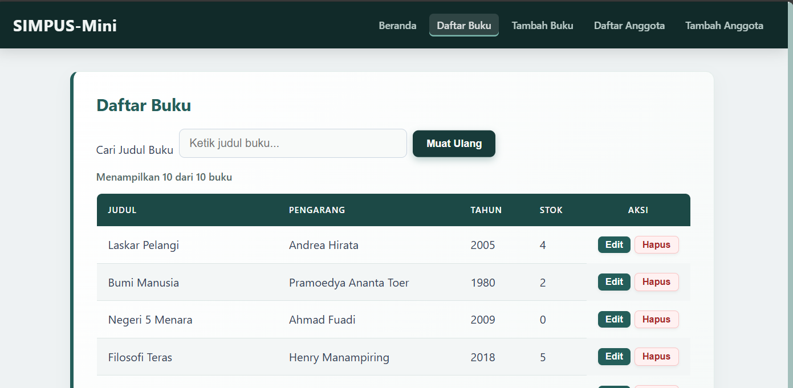
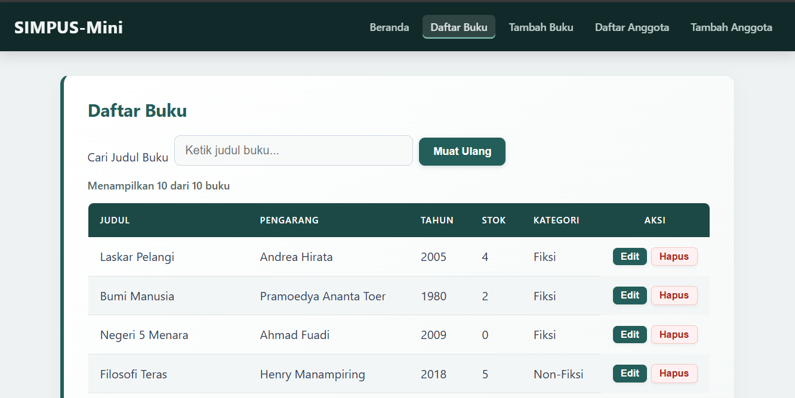
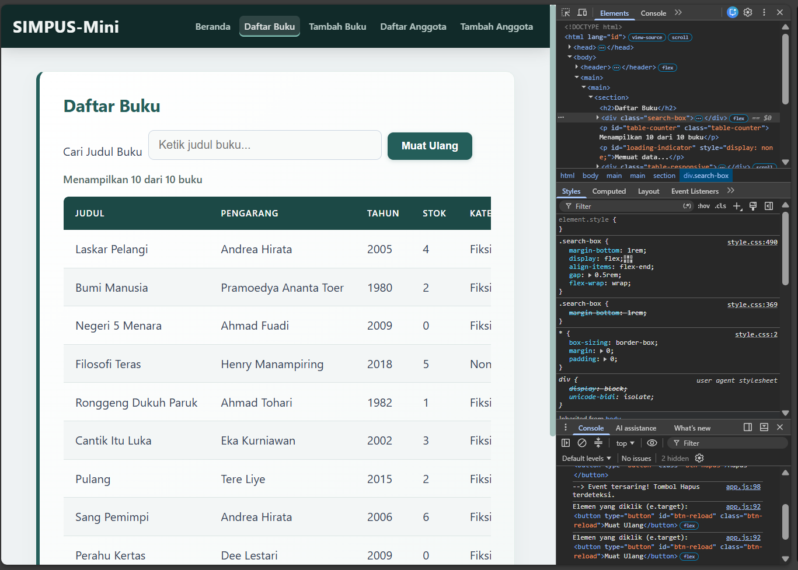
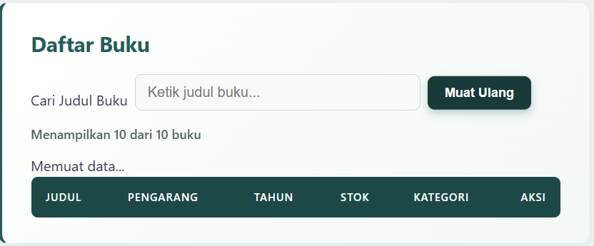

## 8.4 Ide Latihan Tambahan (Opsional)

1. **Tambah tombol "Muat Ulang"** di halaman Daftar Buku yang, saat
   diklik, memanggil ulang `muatDaftarBuku()` — perhatikan fungsi ini
   sudah mengosongkan `tbody` terlebih dulu
   ([bab 4 §4.3]), jadi aman dipanggil berkali-kali.
    **Jawaban:**  
    HTML CODE:
    ```bash
        <button type="button" id="btn-reload" class="btn-reload">Muat Ulang</button>
    ```
    JS CODE:
    ```bash
    // Pasang ulang konfirmasi hapus untuk baris yang baru dibuat
            if (typeof initHapusConfirm === "function") {
                initHapusConfirm();
            }
        } catch (err) {
            tbody.innerHTML =
                '<tr><td colspan="5">Gagal memuat data: ' + err.message + "</td></tr>";
        } finally {
            loading.style.display = "none";
            // Update teks counter jumlah buku
            if (typeof updateTableCounter === "function") {
                updateTableCounter();
            }
        }
    }

    // Event listener untuk tombol Muat Ulang
        const btnReload = document.getElementById("btn-reload");
        if (btnReload) {
            btnReload.addEventListener("click", muatDaftarBuku);
        }
    });
    ```
    CSS CODE:
    ```bash
    /* Styling kontainer pencarian agar input dan tombol sejajar */
        .search-box {
            margin-bottom: 1rem;
            display: flex;
            align-items: flex-end;
            gap: 0.5rem;
            flex-wrap: wrap;
        }

        .search-box > div {
            display: flex;
            flex-direction: column;
        }

        .search-box input {
            max-width: 320px;
        }

    /* Styling Tombol Muat Ulang */
        .btn-reload {
            display: inline-flex;
            align-items: center;
            justify-content: center;
            gap: 0.4rem;
            background-color: #245e5a;
            color: #ffffff;
            font-weight: 600;
            font-size: 0.9rem;
            padding: 0.65rem 1.2rem;
            border-radius: 8px;
            border: none;
            box-shadow: 0 2px 6px rgba(36, 94, 90, 0.2);
            cursor: pointer;
            transition: all 0.2s cubic-bezier(0.16, 1, 0.3, 1);
        }

        .btn-reload:hover {
            background-color: #183b3a;
            transform: translateY(-1px);
            box-shadow: 0 4px 10px rgba(36, 94, 90, 0.3);
        }

        .btn-reload:active {
            transform: scale(0.96);
        }
    ```
    Outputnya:  
    

2. **Satukan `buku.js` dan `anggota.js`** jadi satu fungsi generik yang
   menerima nama file JSON dan daftar nama kunci sebagai parameter —
   latihan langsung untuk pertanyaan yang diajukan di
   [bab 5 §5.4].
    **Jawaban:** 
    assets/js/app.js CODE:
    ```bash
    // Fungsi generik untuk memuat data tabel dari JSON
        async function muatDataTabel(namaFile, kunciKolom) {
            const tbody = document.querySelector(".table-responsive table tbody");
            const loading = document.getElementById("loading-indicator");
            if (!tbody) return;

            loading.style.display = "block";
            tbody.innerHTML = "";  // Mengosongkan tbody terlebih dahulu

            try {
    // Simulasi delay jaringan agar loading indicator terlihat
                await new Promise((resolve) => setTimeout(resolve, 600));

                const res = await fetch(`../data/${namaFile}`);
                if (!res.ok) {
                    throw new Error("Gagal mengambil data (status " + res.status + ")");
                }
                const dataList = await res.json();

                dataList.forEach(function (item) {
                    const tr = document.createElement("tr");

    // Generate sel td berdasarkan urutan kunciKolom yang diminta
                    let tdHtml = kunciKolom
                        .map((kunci) => `<td>${item[kunci] ?? "-"}</td>`)
                        .join("");

    // Tambahkan kolom tombol Aksi di akhir
                    tdHtml += `
                        <td>
                            <button type="button">Edit</button> 
                            <button type="button" class="btn-hapus">Hapus</button>
                        </td>
                    `;

                    tr.innerHTML = tdHtml;
                    tbody.appendChild(tr);
                });

    // Re-bind konfirmasi hapus untuk baris baru
                if (typeof initHapusConfirm === "function") {
                    initHapusConfirm();
                }
            } catch (err) {
                const totalKolom = kunciKolom.length + 1;
                tbody.innerHTML = `<tr><td colspan="${totalKolom}">Gagal memuat data: ${err.message}</td></tr>`;
            } finally {
                loading.style.display = "none";

    // Update counter tabel jika fungsi tersedia
                if (typeof updateTableCounter === "function") {
                    updateTableCounter();
                }
            }
        }
    ```  
    buku.js CODE:
    ```bash
        const kolomBuku = ["judul", "pengarang", "tahun", "stok"];

        function muatDaftarBuku() {
            muatDataTabel("buku.json", kolomBuku);
        }

        document.addEventListener("DOMContentLoaded", function () {
            muatDaftarBuku();

            const btnReload = document.getElementById("btn-reload");
            if (btnReload) {
                btnReload.addEventListener("click", muatDaftarBuku);
            }
        });
    ```  
    anggota.js CODE:
    ```bash
        const kolomAnggota = ["no_anggota", "nama", "alamat", "umur", "no_hp"];

        function muatDaftarAnggota() {
            muatDataTabel("anggota.json", kolomAnggota);
        }

        document.addEventListener("DOMContentLoaded", function () {
            muatDaftarAnggota();

            const btnReload = document.getElementById("btn-reload");
            if (btnReload) {
                btnReload.addEventListener("click", muatDaftarAnggota);
            }
        });
    ```  
    Outputnya:  
    > Tampilannya ga berubah hanya kode nya yang berubah (Fungsi Generik). Tujuannya;
    >    - Prinsip DRY (Efisiensi Kode): Menyatukan fungsi muatDaftarBuku() dan muatDaftarAnggota() menjadi satu logika generik menghapus pengulangan kode fetch, penanganan error, dan manipulasi DOM yang sama.
    >    - Kemudahan Perawatan (Maintainability): Perubahan fitur tabel di masa depan—seperti indikator loading, animasi, atau format tombol Aksi—cukup dilakukan pada satu fungsi di app.js tanpa menyentuh file lain.
    >    - Skalabilitas: Mempermudah pengembangan modul baru (misal: Daftar Transaksi/Denda) cukup dengan memanggil fungsi tersebut menggunakan sumber data dan kunci kolom yang sesuai.

3. **Tambah kolom baru** di `data/buku.json` (misalnya `"kategori"`),
   lalu tampilkan di tabel dengan menambah satu `<th>` di HTML dan satu
   `<td>` di `tr.innerHTML` pada `buku.js`.
    **Jawaban:**  
    data/buku.json CODE:
    ```bash
        [
        { "judul": "Laskar Pelangi", "pengarang": "Andrea Hirata", "tahun": 2005, "stok": 4, "kategori": "Fiksi" },
        { "judul": "Bumi Manusia", "pengarang": "Pramoedya Ananta Toer", "tahun": 1980, "stok": 2, "kategori": "Fiksi" },
        { "judul": "Negeri 5 Menara", "pengarang": "Ahmad Fuadi", "tahun": 2009, "stok": 0, "kategori": "Fiksi" },
        { "judul": "Filosofi Teras", "pengarang": "Henry Manampiring", "tahun": 2018, "stok": 5, "kategori": "Non-Fiksi" },
        { "judul": "Ronggeng Dukuh Paruk", "pengarang": "Ahmad Tohari", "tahun": 1982, "stok": 1, "kategori": "Fiksi" }
        ]
    ```  
    buku/list.html CODE:
    ```bash
            <thead>
        <tr>
            <th>Judul</th>
            <th>Pengarang</th>
            <th>Tahun</th>
            <th>Stok</th>
            <th>Kategori</th>
            <th>Aksi</th>
        </tr>
        </thead>
    ```   
    assets/js/buku.js CODE:
    ```bash
        const kolomBuku = ["judul", "pengarang", "tahun", "stok", "kategori"];

        function muatDaftarBuku() {
            muatDataTabel("buku.json", kolomBuku);
        }
    ```
    Outputnya:  
    

4. **Uji delegasi event lebih jauh** — tambahkan `console.log(e.target)`
   di awal fungsi `initHapusConfirm` ([bab 6]),
   buka Console, lalu klik berbagai tempat di halaman (bukan cuma
   tombol Hapus) untuk melihat sendiri bagaimana `document` menerima
   **semua** event klik di halaman, dan bagaimana `e.target.closest(...)`
   menyaring hanya yang relevan.
    **Jawaban:**   
    ```bash
        function initHapusConfirm() {
            document.addEventListener("click", function (e) {
                // 1. Cetak elemen persis yang diklik oleh user
                console.log("Elemen yang diklik (e.target):", e.target);

                // 2. Saring hanya jika yang diklik (atau elemen di dalamnya) adalah tombol .btn-hapus
                const btnHapus = e.target.closest(".btn-hapus");

                if (btnHapus) {
                    console.log("--> Event tersaring! Tombol Hapus terdeteksi.");

                    const row = btnHapus.closest("tr");
                    const nama = row ? row.querySelector("td")?.textContent : "data ini";
                    const yakin = confirm('Yakin ingin menghapus "' + nama + '"?');

                    if (yakin && row) {
                        row.remove();
                        // Update counter setelah baris dihapus
                        if (typeof updateTableCounter === "function") {
                            updateTableCounter();
                        }
                    }
                }
            });
        }
    ```  
    Outputnya:
      
    > Otomatis Bekerja untuk Data Dinamis: Saat kamu menekan tombol Muat Ulang, data tabel di-render ulang (baris <tr> lama dihapus dan dibuat baru). Dengan event delegation pada document, kamu tidak perlu lagi memanggil ulang initHapusConfirm() setelah data baru dimuat dari JSON.

5. **Ganti delay simulasi** di [bab 4 §4.4]
   dari `600` menjadi `3000` (3 detik), amati loading indicator jadi
   jauh lebih terlihat — ini juga cara yang baik untuk merasakan
   pentingnya loading indicator pada koneksi yang lambat.
    **Jawaban:**  
    ```bash
        await new Promise((resolve) => setTimeout(resolve, 300));
    ```  
    Outputnya:  
      
    > teks "Memuat data..." (loading indicator) muncul dan bertahan selama 3 detik penuh sebelum baris tabel diisi oleh data JSON.
