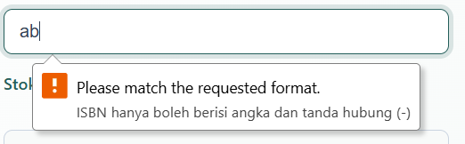
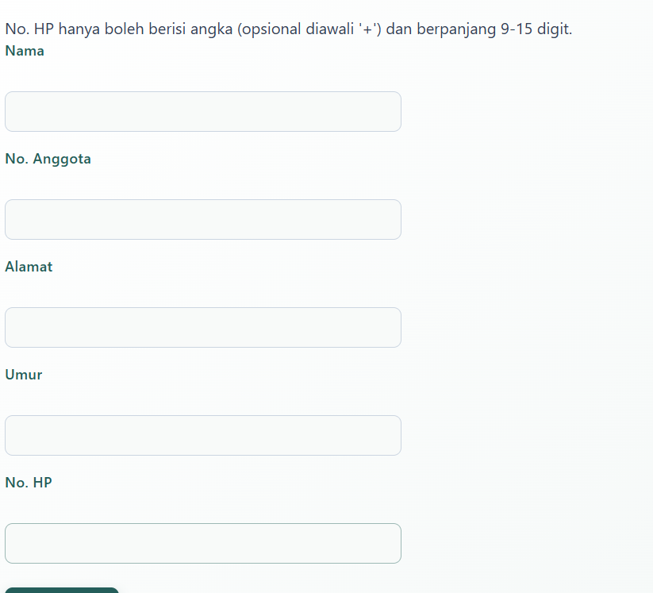
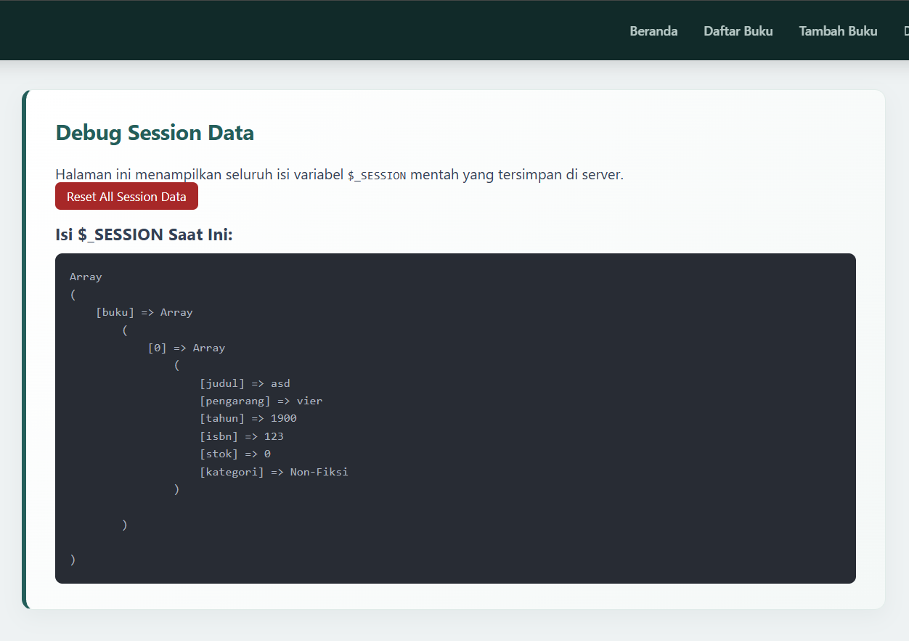
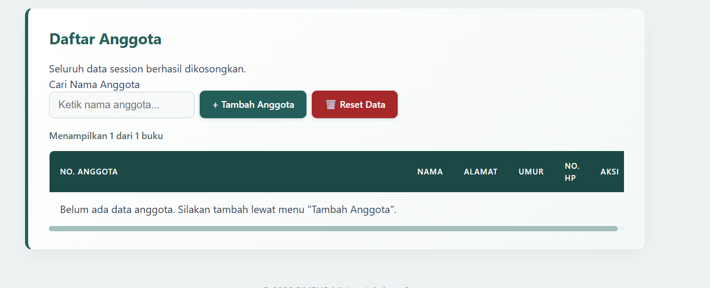

## 7.4 Ide Latihan Tambahan (Opsional)

1. **Tambah validasi ISBN** di `buku/proses_tambah.php` — misalnya
   memastikan ISBN yang diisi (kalau tidak kosong) hanya berisi angka
   dan tanda hubung, memakai fungsi PHP `preg_match()`.
    **Jawaban:**  
    ```bash
        // Validasi ISBN menggunakan preg_match() jika ISBN diisi (tidak kosong)
        if ($isbn !== '' && !preg_match('/^[0-9\-]+$/', $isbn)) {
            $errors[] = "ISBN hanya boleh berisi angka dan tanda hubung (-).";
        }
    ```
    Outputnya:  
    
2. **Tambah flash message di `anggota/proses_tambah.php`** untuk kasus
   yang belum ditangani — bandingkan dengan versi `buku/proses_tambah.php`
   yang sudah divalidasi lebih lengkap (rentang tahun, stok non-negatif)
   — field apa lagi di form anggota yang mungkin perlu aturan validasi
   tambahan?
    **Jawaban:**
    ```bash
        // 1. Validasi Field Wajib
        if ($nama === '') {
            $errors[] = "Nama wajib diisi.";
        }
        if ($noAnggota === '') {
            $errors[] = "No. Anggota wajib diisi.";
        }

        // 2. Validasi Format No. HP (Jika diisi)
        if ($noHp !== '') {
            // Memastikan hanya berisi angka, dengan opsional kode negara '+' di awal, panjang 9 - 15 digit
            if (!preg_match('/^\+?[0-9]{9,15}$/', $noHp)) {
                $errors[] = "No. HP hanya boleh berisi angka (opsional diawali '+') dan berpanjang 9-15 digit.";
            }
        }

        // 3. Validasi Umur (Jika diisi)
        if ($umur !== '') {
            if (!ctype_digit($umur)) {
                $errors[] = "Umur harus berupa angka bulat.";
            } else {
                $umurInt = (int)$umur;
                if ($umurInt < 5 || $umurInt > 100) {
                    $errors[] = "Umur harus berada dalam rentang 5 hingga 100 tahun.";
                }
            }
        }

        // 4. Validasi Cek Duplikasi No. Anggota dalam Session
        if ($noAnggota !== '' && isset($_SESSION['anggota'])) {
            foreach ($_SESSION['anggota'] as $anggota) {
                if (strcasecmp($anggota['no_anggota'], $noAnggota) === 0) {
                    $errors[] = "No. Anggota '$noAnggota' sudah terdaftar.";
                    break;
                }
            }
        }

        // Jika terdapat error validasi, kirim pesan flash dan kembalikan ke form tambah
        if (!empty($errors)) {
            $_SESSION['flash'] = ['type' => 'error', 'pesan' => implode(' ', $errors)];
            header('Location: tambah.php');
            exit;
        }

        // Inisialisasi session anggota jika belum ada
        if (!isset($_SESSION['anggota'])) {
            $_SESSION['anggota'] = [];
        }

        // Simpan data anggota baru ke session
        $_SESSION['anggota'][] = [
            'nama' => $nama,
            'no_anggota' => $noAnggota,
            'alamat' => $alamat,
            'umur' => $umur,
            'no_hp' => $noHp,
        ];
    ```
    Outputnya:  
    
3. **Buat halaman `debug_session.php`** sementara (untuk latihan, hapus
   setelah selesai) yang menampilkan isi `$_SESSION` mentah lewat
   `<pre><?php print_r($_SESSION); ?></pre>` — cara yang berguna untuk
   "mengintip" langsung apa yang sebenarnya tersimpan di server saat
   belajar.
    **Jawaban:** 
    debug_session.php CODE: 
    ```bash
        <?php
        // Paksa PHP untuk menampilkan pesan error di layar
        ini_set('display_errors', 1);
        ini_set('display_startup_errors', 1);
        error_reporting(E_ALL);

        // Baru kode session & include
        if (session_status() === PHP_SESSION_NONE) {
            session_start();
        }
        $page_title = "Debug Session (Sementara)";
        include __DIR__ . '/includes/header.php';
        ?>

        <section>
            <h2>Debug Session Data</h2>
            <p>Halaman ini menampilkan seluruh isi variabel <code>$_SESSION</code> mentah yang tersimpan di server.</p>

            <!-- Tombol untuk mereset/menghapus semua session jika ingin mulai dari awal -->
            <p style="margin-bottom: 1rem;">
                <a href="debug_session.php?action=reset" 
                    onclick="return confirm('Yakin ingin menghapus seluruh data session?');" 
                    style="background: #a72828; color: #fff; padding: 0.4rem 0.8rem; border-radius: 6px; font-size: 0.85rem;">
                    Reset All Session Data
                </a>
            </p>

            <?php
            // Fitur Opsional: Reset session lewat parameter URL
            if (isset($_GET['action']) && $_GET['action'] === 'reset') {
                session_unset();
                session_destroy();
                header('Location: debug_session.php');
                exit;
            }
            ?>

            <h3>Isi $_SESSION Saat Ini:</h3>
            <div class="code-responsive" style="background: #282c34; color: #abb2bf; padding: 1rem; border-radius: 8px; margin-top: 0.5rem;">
                <pre><?php print_r($_SESSION); ?></pre>
            </div>
        </section>

        <?php include __DIR__ . '/includes/footer.php'; ?>
    ```
    Outputnya:  
      

4. **Tambah tombol "Reset Data"** yang memanggil `session_destroy()`
   untuk mengosongkan seluruh `$_SESSION` secara manual, tanpa perlu
   menutup browser — cari tahu sendiri lewat dokumentasi PHP resmi
   bagaimana fungsi ini bekerja.
   **Jawabannya:**  
   reset_session.php CODE:
    ```bash
           <?php
        if (session_status() === PHP_SESSION_NONE) {
            session_start();
        }

        // 1. Kosongkan semua isi variabel $_SESSION
        session_unset();

        // 2. Hancurkan data session di server
        session_destroy();

        // 3. Mulai session baru lagi untuk menampung pesan flash
        session_start();
        $_SESSION['flash'] = [
            'type' => 'success', 
            'pesan' => 'Seluruh data session berhasil dikosongkan.'
        ];

        // 4. Redirect kembali ke halaman asal (atau ke index.php jika HTTP_REFERER kosong)
        $referer = $_SERVER['HTTP_REFERER'] ?? '../index.php';
        header("Location: " . $referer);
        exit;
    ```
    list.php CODE:
    ```bash
        <!-- Tombol Reset Data Session -->
        <a href="../includes/reset_session.php" 
           class="btn-reload" 
           style="background-color: #a72828; text-decoration: none;"
           onclick="return confirm('Apakah Anda yakin ingin menghapus seluruh data session?');">
            🗑️ Reset Data
        </a>
    ```
    Outputnya:   
    
