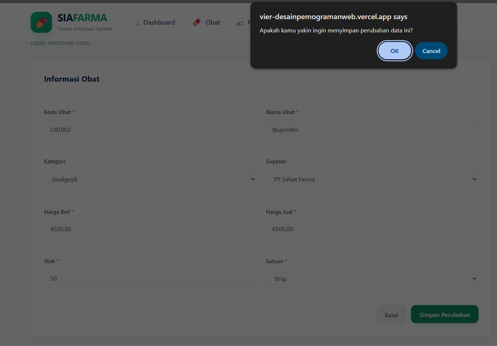
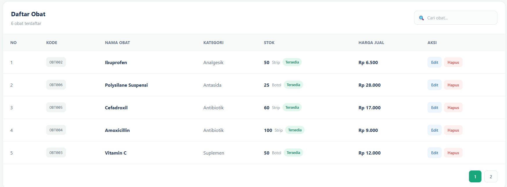

## Ide Latihan Tambahan (Opsional)

1. **Tambah konfirmasi ekstra sebelum Update** — bandingkan dengan
   Delete yang sudah punya `confirm()`; apakah Update juga butuh
   konfirmasi serupa? Pertimbangkan kapan konfirmasi tambahan
   benar-benar diperlukan (ingat: Update tidak destruktif seperti
   Delete, data lama masih "terlihat" sebelum diubah).
   **Jawabanya:**
    ```bash
    // Tambahkan fungsi ini di app.js
        function initEditConfirm() {
            // Mendeteksi pengiriman form yang memiliki action ke proses_edit.php
            const editForms = document.querySelectorAll('form[action="proses_edit.php"]');
            
            editForms.forEach(form => {
                form.addEventListener('submit', function (e) {
                    const yakin = confirm("Apakah kamu yakin ingin menyimpan perubahan data ini?");
                    if (!yakin) {
                        e.preventDefault(); // Batalkan penyimpanan jika pilih Cancel
                    }
                });
            });
        }
    ```  
    Outputnya:  
    

2. **Ubah jumlah baris per halaman** — ganti `$perPage = 5;` menjadi
   `10` di `buku/list.php`, amati bagaimana jumlah total halaman
   berubah mengikuti.
3. **Tambah pencarian di kolom lain** — misalnya perluas query di
   [bab 5 §5.6] supaya juga mencocokkan kolom `pengarang`, bukan cuma `judul`
   (petunjuk: gunakan `OR` di klausa `WHERE`).
4. **Terapkan pola Update/Delete ke fitur lain** — kalau kamu menambah
   entitas baru di proyek pribadimu nanti, coba terapkan pola CRUD
   yang sama persis: `list.php` (Read + pagination), `tambah.php`
   (Create), `edit.php` (Update), `hapus.php` (Delete) — pola 4 file
   ini akan terus berulang untuk hampir semua data yang perlu dikelola.
   **Jawaban No.2-4:**
   ```bash
        <?php
        $page_title = "Data Kategori";
        require __DIR__ . '/../includes/koneksi.php';
        include __DIR__ . '/../includes/header.php';

        $q = trim($_GET['q'] ?? '');
        $halaman = max(1, (int) ($_GET['halaman'] ?? 1));
        $perHalaman = 10; // LATIHAN 2: Menampilkan 10 baris per halaman

        // LATIHAN 3: Pencarian di banyak kolom menggunakan OR
        $hitung = $pdo->prepare("
            SELECT COUNT(*) FROM kategori 
            WHERE nama_kategori ILIKE :kw OR deskripsi ILIKE :kw
        ");
        $hitung->execute(['kw' => "%$q%"]);
        $totalData = (int) $hitung->fetchColumn();

        $totalHalaman = max(1, (int) ceil($totalData / $perHalaman));
        $halaman = min($halaman, $totalHalaman);
        $offset = ($halaman - 1) * $perHalaman;

        // LATIHAN 4: Menerapkan pola Read + Pagination ke entitas Kategori
        $stmt = $pdo->prepare("
            SELECT 
                kategori.id, 
                kategori.nama_kategori, 
                kategori.deskripsi, 
                COUNT(obat.id) AS jumlah_obat
            FROM kategori
            LEFT JOIN obat ON obat.kategori_id = kategori.id
            WHERE kategori.nama_kategori ILIKE :kw OR kategori.deskripsi ILIKE :kw
            GROUP BY kategori.id, kategori.nama_kategori, kategori.deskripsi
            ORDER BY kategori.id DESC
            LIMIT :limit OFFSET :offset
        ");
        $stmt->bindValue(':kw', "%$q%", PDO::PARAM_STR);
        $stmt->bindValue(':limit', $perHalaman, PDO::PARAM_INT);
        $stmt->bindValue(':offset', $offset, PDO::PARAM_INT);
        $stmt->execute();
        $kategori = $stmt->fetchAll();
        ?>

        <div class="page-header">
            <div>
                <h2>Data Kategori</h2>
                <p>Kelola kategori obat yang tersedia di apotek.</p>
            </div>
            <a href="tambah.php" class="btn btn-primary">+ Tambah Kategori</a>
        </div>

        <div class="card">
            <div class="card-header">
                <div>
                    <h3>Daftar Kategori</h3>
                    <span class="card-description"><?php echo $totalData; ?> kategori terdaftar</span>
                </div>

                <form method="get" action="list.php" style="margin: 0; padding: 0;">
                    <div class="search-box">
                        <span style="font-size: 13px;">🔍</span>
                        <input type="text" name="q" value="<?php echo htmlspecialchars($q); ?>" placeholder="Cari nama atau deskripsi..." autocomplete="off">
                    </div>
                </form>
            </div>

            <div class="table-responsive">
                <table>
                    <thead>
                        <tr>
                            <th>NO</th>
                            <th>NAMA KATEGORI</th>
                            <th>DESKRIPSI</th>
                            <th>JUMLAH OBAT</th>
                            <th>AKSI</th>
                        </tr>
                    </thead>
                    <tbody>
                    <?php if (empty($kategori)): ?>
                        <tr>
                            <td colspan="5" class="empty-data">Data kategori tidak ditemukan.</td>
                        </tr>
                    <?php else: ?>
                        <?php foreach ($kategori as $index => $item): ?>
                            <tr>
                                <td><?php echo $offset + $index + 1; ?></td>
                                <td><strong><?php echo htmlspecialchars($item['nama_kategori']); ?></strong></td>
                                <td><?php echo htmlspecialchars($item['deskripsi'] ?: '-'); ?></td>
                                <td><span class="count-badge"><?php echo $item['jumlah_obat']; ?> obat</span></td>
                                <td>
                                    <div class="action-buttons">
                                        <a href="edit.php?id=<?php echo $item['id']; ?>" class="btn-action edit">Edit</a>

                                        <form class="form-hapus-inline" method="post" action="hapus.php" style="display: inline-block; margin: 0; padding: 0;">
                                            <input type="hidden" name="id" value="<?php echo $item['id']; ?>">
                                            <button type="submit" class="btn-action delete btn-hapus" style="border: none; outline: none; cursor: pointer; font-family: inherit;">Hapus</button>
                                        </form>
                                    </div>
                                </td>
                            </tr>
                        <?php endforeach; ?>
                    <?php endif; ?>
                    </tbody>
                </table>
            </div>

            <?php if ($totalHalaman > 1): ?>
            <div style="padding: 18px 22px; display: flex; gap: 8px; justify-content: flex-end; border-top: 1px solid #edf2f1;">
                <?php for ($i = 1; $i <= $totalHalaman; $i++): ?>
                    <a href="?q=<?php echo urlencode($q); ?>&halaman=<?php echo $i; ?>" 
                       style="padding: 6px 14px; border-radius: 7px; font-size: 12px; font-weight: 600; text-decoration: none; border: 1px solid <?php echo $i === $halaman ? '#18a77a' : '#dfe8e5'; ?>; <?php echo $i === $halaman ? 'background: #18a77a; color: white;' : 'background: #fbfdfc; color: #68778d;'; ?>">
                        <?php echo $i; ?>
                    </a>
                <?php endfor; ?>
            </div>
            <?php endif; ?>
        </div>

        <?php include __DIR__ . '/../includes/footer.php'; ?>
   ```  
   Outputnya:  
   