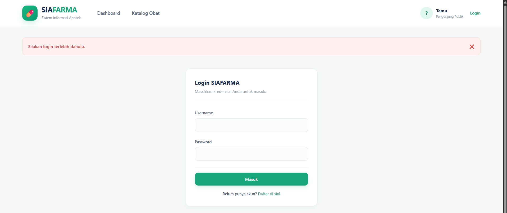
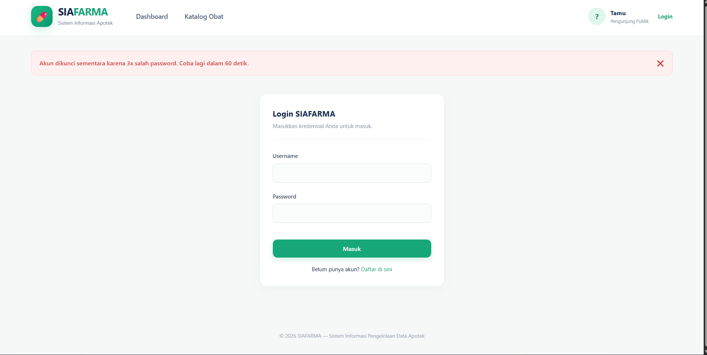

## Ide Latihan Tambahan (Opsional)

1. **Terapkan kontrol akses berbasis `role`** — sesuai catatan di
   [README.md](../README.md) jobsheet ini yang menyebutnya sebagai
   tugas mandiri: buat aturan misalnya hanya `role === 'admin'` yang
   boleh mengakses `anggota/hapus.php`, sementara `'petugas'` biasa
   hanya boleh melihat dan menambah data. Petunjuk: kamu perlu
   menambah pengecekan baru **setelah** `require auth.php`, memeriksa
   `$_SESSION['role']`.
   **Jawaban:**
    ```bash
           if ($_SESSION['user_role'] !== 'admin') {
            $_SESSION['flash'] = [
                'type' => 'error', 
                'pesan' => 'Akses ditolak. Hanya Administrator yang diizinkan menghapus data.'
            ];
            header('Location: list.php');
            exit;
        }
    ```  
      Outputnya:  
      
2. **Tambah "Ingat Saya" (Remember Me)** — cari tahu lewat dokumentasi
   PHP resmi bagaimana cookie dengan masa berlaku panjang bisa dipakai
   untuk menjaga sesi login tetap aktif meski browser ditutup (petunjuk:
   fungsi `setcookie()`), lalu diskusikan sendiri risiko keamanannya
   dibanding sekadar mengandalkan `$_SESSION` biasa.
   **Jawaban:**
   ```bash
      <?php
      session_start();
      require __DIR__ . '/../includes/koneksi.php';

      if ($_SERVER['REQUEST_METHOD'] === 'POST') {
          $username = trim($_POST['username'] ?? '');
          $password = $_POST['password'] ?? '';

          if ($username === '' || $password === '') {
              $_SESSION['flash'] = ['type' => 'error', 'pesan' => 'Username dan password wajib diisi.'];
              header('Location: login.php');
              exit;
          }

          $stmt = $pdo->prepare("SELECT id, nama, password, role FROM users WHERE username = :username");
          $stmt->execute(['username' => $username]);
          $user = $stmt->fetch();

          // Verifikasi hash menggunakan password_verify
          if ($user && password_verify($password, $user['password'])) {
              $_SESSION['user_id'] = $user['id'];
              $_SESSION['user_nama'] = $user['nama'];
              $_SESSION['user_role'] = $user['role'];

              $_SESSION['flash'] = ['type' => 'success', 'pesan' => 'Selamat datang, ' . $user['nama']];
              header('Location: ../index.php');
              exit;
          } else {
              $_SESSION['flash'] = ['type' => 'error', 'pesan' => 'Username atau password salah.'];
              header('Location: login.php');
              exit;
          }
      }
   ```  
   Outputnya:  
   

3. **Batasi percobaan Login yang gagal** — tambahkan penghitung
   percobaan gagal per username (bisa disimpan sementara di
   `$_SESSION` untuk latihan), dan tampilkan peringatan setelah
   beberapa kali gagal berturut-turut — langkah awal mencegah serangan
   *brute-force* menebak password.
   **Jawaba:**  
   ```bash
      <?php
      session_start();
      require __DIR__ . '/../includes/koneksi.php';

      // 1. Periksa apakah akun sedang dikunci sementara karena terlalu banyak gagal login
      if (isset($_SESSION['lockout_time']) && time() < $_SESSION['lockout_time']) {
          $sisa_waktu = $_SESSION['lockout_time'] - time();
          $_SESSION['flash'] = [
              'type' => 'error', 
              'pesan' => "Terlalu banyak percobaan gagal. Silakan tunggu $sisa_waktu detik lagi."
          ];
          header('Location: login.php');
          exit;
      }

      if ($_SERVER['REQUEST_METHOD'] === 'POST') {
          $username = trim($_POST['username'] ?? '');
          $password = $_POST['password'] ?? '';

          if ($username === '' || $password === '') {
              $_SESSION['flash'] = ['type' => 'error', 'pesan' => 'Username dan password wajib diisi.'];
              header('Location: login.php');
              exit;
          }

          $stmt = $pdo->prepare("SELECT id, nama, password, role FROM users WHERE username = :username");
          $stmt->execute(['username' => $username]);
          $user = $stmt->fetch();

          // 2. Cek kecocokan password
          if ($user && password_verify($password, $user['password'])) {
              // Jika BERHASIL: Reset hitungan gagal login dan lockout
              unset($_SESSION['login_attempts']);
              unset($_SESSION['lockout_time']);

              $_SESSION['user_id'] = $user['id'];
              $_SESSION['user_nama'] = $user['nama'];
              $_SESSION['user_role'] = $user['role'];

              $_SESSION['flash'] = ['type' => 'success', 'pesan' => 'Selamat datang, ' . $user['nama']];
              header('Location: ../index.php');
              exit;
          } else {
              // 3. Jika GAGAL: Tambah jumlah percobaan gagal di session
              $_SESSION['login_attempts'] = ($_SESSION['login_attempts'] ?? 0) + 1;

              // Jika sudah gagal 3 kali, kunci selama 60 detik
              if ($_SESSION['login_attempts'] >= 3) {
                  $_SESSION['lockout_time'] = time() + 60; 
                  $_SESSION['flash'] = [
                      'type' => 'error', 
                      'pesan' => 'Akun dikunci sementara karena 3x salah password. Coba lagi dalam 60 detik.'
                  ];
              } else {
                  $sisa_coba = 3 - $_SESSION['login_attempts'];
                  $_SESSION['flash'] = [
                      'type' => 'error', 
                      'pesan' => "Username atau password salah. (Sisa percobaan: $sisa_coba kali)"
                  ];
              }

              header('Location: login.php');
              exit;
          }
      }
   ```
4. **Uji coba mematikan PostgreSQL** sesuai catatan di
   [README.md](../README.md) jobsheet ini — coba hentikan sementara
   layanan PostgreSQL di komputermu, lalu akses `/buku/tambah.php`
   tanpa login — buktikan sendiri kamu tetap diarahkan ke Login
   (bukan melihat error koneksi database), sesuai penjelasan di
   [bab 4 §4.6]
   **Jawaban:**
   > Alasan utama guard clause (seperti file auth.php milikmu) harus mandiri dan bergantung pada $_SESSION—bukan database—adalah untuk mencegah kegagalan sistem (system failure) yang berisiko mengekspos halaman rahasia.
   >
    > Sesi PHP disimpan secara lokal di dalam memori atau direktori file server web, sehingga pengecekan status login dan hak akses bisa dilakukan secara instan. Jika server PostgreSQL mati atau mengalami gangguan koneksi, guard clause tetap berfungsi sempurna menendang akses tidak sah kembali ke halaman login. Hal ini menghemat sumber daya dan mencegah error database (Fatal Error) yang bisa saja memotong pengeksekusian script keamanan.