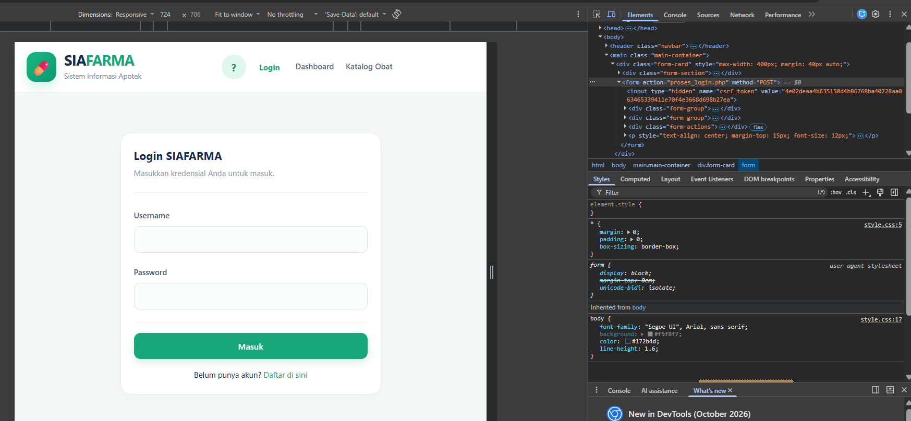

| | |
| :--- | :--- |
| **Mata Kuliah** | : Desain dan Pemrograman Web |
| **Program Studi** | : D4 – Teknik Informatika |
| **Semester** | : 3 |

---

| | |
| :--- | :--- |
| **Kelas** | : TI-2D |
| **NIM** | : 254107020019 |
| **Nama** | : M. Javier Thufail |
| **Jobsheet Ke-** | : 8 |

---

# Laporan Praktikum Jobsheet 11: Keamanan Web Dasar

## 1. Deskripsi Tugas
Pada Jobsheet 11, fokus utama praktikum adalah melakukan audit dan peningkatan keamanan web dasar pada aplikasi **SIAFARMA (Sistem Informasi Apotek)**. Pengujian dan mitigasi dilakukan terhadap lima kerentanan utama web:
1. **Cross-Site Scripting (XSS)**
2. **Cross-Site Request Forgery (CSRF)**
3. **Session Fixation**
4. **SQL Injection**
5. **Validasi & Sanitasi Input**

---

## 2. Perubahan & Implementasi Kode SIAFARMA

### 2.1. File Helper Keamanan (`includes/helpers.php` & `includes/csrf.php`)
Dua file baru ditambahkan ke folder `includes/` dan dimuat otomatis di `includes/header.php`.

*   **`includes/helpers.php`**: Menyediakan fungsi `e()` sebagai wrapper `htmlspecialchars()` untuk mencegah XSS.
    ```php
    <?php
    function e($value) {
        return htmlspecialchars((string) ($value ?? ''), ENT_QUOTES, 'UTF-8');
    }
    ```

*   **`includes/csrf.php`**: Menyediakan fungsi pembentuk token (`csrf_token()`), field tersembunyi (`csrf_field()`), dan fungsi verifikasi (`csrf_verify()`).
    ```php
    <?php
    function csrf_token() {
        if (empty($_SESSION['csrf_token'])) {
            $_SESSION['csrf_token'] = bin2hex(random_bytes(32));
        }
        return $_SESSION['csrf_token'];
    }

    function csrf_field() {
        return '<input type="hidden" name="csrf_token" value="' . csrf_token() . '">';
    }

    function csrf_verify() {
        $token = $_POST['csrf_token'] ?? '';
        if ($token === '' || !hash_equals($_SESSION['csrf_token'] ?? '', $token)) {
            http_response_code(403);
            die('Permintaan ditolak: token CSRF tidak valid atau kedaluwarsa.');
        }
    }
    ```

---

### 2.2. Mitigasi Cross-Site Scripting (XSS)
Seluruh cetakan data dari database, variabel sesi, maupun parameter URL (`$_GET`) pada tampilan SIAFARMA (seperti nama obat, kode, kategori, supplier, nama petugas di navbar, dan input pencarian) dibungkus menggunakan fungsi `e()`.

Contoh penerapan pada `obat/list.php` dan `includes/header.php`:
```php
<!-- Sebelum (XSS Vulnerable) -->
<td><?php echo $item['nama_obat']; ?></td>
<input type="text" name="q" value="<?php echo $q; ?>">

<!-- Sesudah (Aman dengan e()) -->
<td><?php echo e($item['nama_obat']); ?></td>
<input type="text" name="q" value="<?php echo e($q); ?>">
<span><?php echo e($_SESSION['user_nama']); ?></span>
```

---

### 2.3. Mitigasi Cross-Site Request Forgery (CSRF)
Setiap formulir ber-metode `POST` (Tambah/Edit/Hapus Obat, Kategori, Supplier, Penjualan, Login, dan Register) disisipi token CSRF via `csrf_field()`. 

Sisi *backend* (`proses_*.php` dan `hapus.php`) memanggil `csrf_verify()` sebelum memproses data ke database.

Contoh penerapan pada `obat/tambah.php` dan `obat/proses_tambah.php`:
```php
<!-- obat/tambah.php -->
<form action="proses_tambah.php" method="POST">
    <?php echo csrf_field(); ?>
    <!-- Input form lainnya -->
</form>
```

```php
// obat/proses_tambah.php
require __DIR__ . '/../includes/auth.php';
require __DIR__ . '/../includes/csrf.php';
require __DIR__ . '/../includes/koneksi.php';

// Verifikasi token CSRF sebelum mengeksekusi Query
csrf_verify();

// Lanjutan proses simpan data...
```

---

### 2.4. Pencegahan Session Fixation
Pada file `auth/proses_login.php`, ID sesi diperbarui segera setelah kata sandi pengguna berhasil diverifikasi dengan `password_verify()`.

```php
if ($user && password_verify($password, $user['password'])) {
    // Regenerasi session ID untuk membuang session ID lama sebelum login
    session_generate_id(true);
    
    $_SESSION['user_id'] = $user['id'];
    $_SESSION['user_nama'] = $user['nama'];
    $_SESSION['user_role'] = $user['role'];
    
    header('Location: ../index.php');
    exit;
}
```

---

## 3. Dokumen Audit Keamanan (`docs/security-checklist.md`)

File dokumentasi audit dibuat di folder `docs/security-checklist.md` untuk mencatat bukti pengujian *before/after*:

```markdown
# Checklist Keamanan — SIAFARMA (Jobsheet 11)

| # | Kerentanan | Ditemukan di | Sebelum | Sesudah (Perbaikan) |
|---|---|---|---|---|
| 1 | **SQL Injection** | Semua query di `obat/`, `kategori/`, `supplier/`, `penjualan/`, `auth/` | Menggunakan PDO Prepared Statements (`:parameter`) sejak Jobsheet 8 | **Diaudit Ulang (Aman):** Tidak ada string SQL yang digabung langsung dengan `$_POST`/`$_GET`. Input `' OR '1'='1` pada login gagal melakukan bypass. |
| 2 | **XSS (Cross-Site Scripting)** | `obat/list.php`, `kategori/list.php`, `supplier/list.php`, `includes/header.php` | Output data dicetak langsung menggunakan `echo` tanpa escaping | Dibungkus fungsi `e()` (`htmlspecialchars` dengan `ENT_QUOTES`). Uji coba input judul `<script>alert(1)</script>` tampil sebagai teks biasa. |
| 3 | **CSRF (Cross-Site Request Forgery)** | Form Tambah/Edit/Hapus (Obat, Kategori, Supplier, Penjualan), Login, Register | Form `POST` tidak memiliki verifikasi token | Ditambahkan `csrf_field()` pada form dan `csrf_verify()` pada file `proses_*.php` & `hapus.php`. Akses eksternal via `curl` tanpa token menghasilkan HTTP 403. |
| 4 | **Validasi & Sanitasi Input** | All `proses_tambah.php` & `proses_edit.php` | Sudah divalidasi tipe dan nilainya sejak Jobsheet 7-9 | **Diaudit Ulang (Aman):** Ditambahkan type casting `(int)` secara eksplisit pada parameter ID hidden input form edit. |
| 5 | **Session Fixation** | `auth/proses_login.php` | ID sesi tidak diperbarui saat transisi login | `session_regenerate_id(true)` dipanggil tepat setelah `password_verify()` berhasil. |
```

---

## 4. Pengujian Keamanan

1.  **Pengujian CSRF (cURL Test):**
    Mengirim permintaan `POST` secara manual tanpa token CSRF ke file pemroses:
    ```bash
    curl -X POST http://localhost:8000/obat/proses_tambah.php -d "nama_obat=Paracetamol"
    ```
    *Hasil:* Server menolak permintaan dengan status **HTTP 403 Forbidden** ("Permintaan ditolak: token CSRF tidak valid atau kedaluwarsa.").

2.  **Pengujian XSS:**
    Menambahkan data obat dengan nama `<script>alert('XSS')</script>`.
    *Hasil:* Pada tabel `obat/list.php`, string dicetak sebagai teks harfiah `&lt;script&gt;...` dan tidak mengeksekusi skrip JavaScript.

3.  **Pengujian Urutan Guard (Middleware):**
    Mengirim permintaan `POST` tanpa login sama sekali.
    *Hasil:* Guard `includes/auth.php` berjalan lebih dulu dibanding `csrf_verify()`, sehingga pengguna langsung di-redirect ke `auth/login.php`.

---

**Outputnya:**  
    

---

## 5. Kesimpulan
Praktikum Jobsheet 11 berhasil meningkatkan standar keamanan aplikasi SIAFARMA secara komprehensif. Penggunaan `e()` mengeliminasi risiko XSS pada layer tampilan, integrasi token CSRF melindungi aplikasi dari aksi berbahaya lintas situs, dan penerapan `session_regenerate_id(true)` mencegah *Session Hijacking/Fixation*. Audit juga mengonfirmasi bahwa penggunaan *Prepared Statements* sejak Jobsheet 8 membuat aplikasi ini sepenuhnya kebal terhadap serangan *SQL Injection*.